# VISION Platform Shell - Product Requirements Document (PRD)

**Version:** 2.0  
**Date:** November 19, 2025  
**Owner:** TwentyNine Eleven Impact Partners  
**Status:** Ready for Development - Front-End First Approach

---

## Executive Summary

The **VISION Platform Shell** is the foundational infrastructure layer that powers the entire VISION application ecosystem. It provides unified authentication, centralized data storage, document management, and seamless app-to-app navigation for nonprofit organizations.

Unlike traditional all-in-one platforms, VISION Platform is designed as a **database-first nonprofit ecosystem** where each organization has its own isolated environment, and multiple AI-powered applications share data through a common infrastructure.

**Phase 1 Focus**: Build the Platform Shell with core features that all applications will leverage:
- Unified authentication and organization management
- Platform dashboard with app launcher
- Centralized document library with AI parsing
- Admin portal for platform operators (29/11 staff)
- Settings management (individual and organizational)

**Development Approach**: **Front-end first** - Build UI components and user flows to visualize the platform before implementing complex provisioning logic.

---

## 1. Platform Vision & Positioning

### 1.1 What VISION Platform Is

VISION Platform is a **suite of purpose-built applications** for nonprofit organizations, where:
- Each app provides **standalone value** (e.g., grant writing, capacity assessment, donor management)
- Apps become **exponentially more powerful** when used together through shared data
- All apps access a **common data warehouse** unique to each organization
- Organizations pay per app ($49-89/month) or get the complete platform ($349/month)

**Key Difference from Competitors**: Rather than forcing nonprofits to adopt a monolithic system, VISION allows them to start with individual tools and grow into the full ecosystem at their own pace.

### 1.2 User Ecosystems

The platform serves three distinct user types (full implementation in Phase 2):

#### **Individual/Organization Users** (Phase 1 Focus)
- Staff members within a single nonprofit organization
- Access apps subscribed by their organization
- Different roles: Executives, Managers, General Staff
- **Can proceed directly** to create/join organization

#### **Funders** (Phase 2)
- Grant-making foundations, corporate donors
- Need to track multiple grantee organizations
- Require custom provisioning by support team
- **Must contact support** for account setup

#### **Consultants** (Phase 2)
- Independent consultants serving multiple nonprofit clients
- Need access to multiple organizations with different roles per org
- Require custom provisioning by support team
- **Must contact support** for account setup

---

## 2. Platform Shell Architecture

### 2.1 Core Components

The Platform Shell consists of 5 major components:

```
┌─────────────────────────────────────────────────────────────┐
│                    PLATFORM SHELL                           │
├─────────────────────────────────────────────────────────────┤
│                                                             │
│  1. Authentication & User Management                        │
│     └─ Sign up, sign in, user profiles, org selection      │
│                                                             │
│  2. Platform Dashboard                                      │
│     └─ App launcher, notifications, quick actions          │
│                                                             │
│  3. Document Library (Priority Feature)                     │
│     └─ Upload, AI parsing, organization, search            │
│                                                             │
│  4. Settings Management                                     │
│     └─ Individual settings, organizational settings         │
│                                                             │
│  5. Admin Portal (Super Users Only)                         │
│     └─ User provisioning, org management, platform config   │
│                                                             │
└─────────────────────────────────────────────────────────────┘
                           │
              ┌────────────┴────────────┐
              │                         │
         [App 1]                   [App 2]
      CapacityIQ              FundingFramer
              │                         │
         [App 3]                   [App 4]
      Grant Writer              CRM Lite
```

### 2.2 Technology Stack

```yaml
Frontend:
  Framework: Next.js 14+ (App Router)
  Language: TypeScript
  Styling: Tailwind CSS + shadcn/ui
  State: Zustand
  Forms: React Hook Form + Zod validation
  
Backend:
  Database: Supabase (PostgreSQL + Row-Level Security)
  Auth: Supabase Auth (JWT-based)
  Storage: Supabase Storage
  Edge Functions: Supabase Edge Functions
  
AI Integration:
  Primary: Claude API (Anthropic) for document parsing
  Embeddings: OpenAI for semantic search
  
Deployment:
  Hosting: Vercel (Serverless)
  Monorepo: pnpm workspaces
  
Domain Strategy:
  Platform Shell: visionimpacthub.com
  Apps: [appname].visionimpacthub.com
```

---

## 3. User Onboarding Flow

### 3.1 Complete Onboarding Journey (Future State)

**NOTE**: This represents the ideal user flow. For Phase 1 development, we will build the UI without implementing Funder/Consultant provisioning logic.


### 3.2 Phase 1 Simplified Flow (Development Focus)

For initial development, we implement only the Individual/Organization path:

**Step 1: Landing Page**
- Platform overview and value proposition
- "Get Started" CTA → Sign Up Form
- Login option for existing users

**Step 2: Sign Up Form**
```typescript
interface SignUpForm {
  firstName: string;
  lastName: string;
  email: string;
  password: string;
  userType: 'individual' | 'organization'; // Phase 1 only
  // Phase 2: Add 'funder' | 'consultant' with conditional logic
}
```

**Step 3: Email Verification**
- Confirm email address
- Send verification link

**Step 4: Organization Setup**
- Create new organization OR join existing organization
- Organization details: name, EIN, address, mission statement

**Step 5: Platform Dashboard**
- User lands on main dashboard
- Can now access subscribed applications

---

## 4. Platform Dashboard

### 4.1 Dashboard Layout

The Platform Dashboard is the central hub where users manage their workspace and access all applications.

```
┌─────────────────────────────────────────────────────────────┐
│  VISION Platform  │  [Org Name]  │  [Notifications 🔔]  [👤] │ ← Header
├───────────────────────────────────────────────────────────────┤
│                                                              │
│  ┌─────────────────────────────────────────────────────┐    │
│  │                                                      │    │
│  │  Welcome back, [User Name]!                         │    │
│  │  [Organization Name]                                │    │
│  │                                                      │    │
│  │  🎯 Quick Actions:                                  │    │
│  │    ▸ Upload Document    ▸ Start Assessment         │    │
│  │                                                      │    │
│  └─────────────────────────────────────────────────────┘    │
│                                                              │
│  📊 Recent Activity & Notifications                          │
│  ┌──────────────────────────────────────────────────────┐   │
│  │ 🟢 CapacityIQ: Assessment "Q4 2025" completed       │   │
│  │ 🟡 FundingFramer: Grant draft ready for review      │   │
│  │ 🔵 Document Library: 3 new documents uploaded       │   │
│  └──────────────────────────────────────────────────────┘   │
│                                                              │
│  📱 Your Applications                                        │
│  ┌────────────┐ ┌────────────┐ ┌────────────┐              │
│  │ CapacityIQ │ │ FundingFrm │ │ CRM Lite   │              │
│  │ [Icon]     │ │ [Icon]     │ │ [Icon]     │              │
│  │ Active ✓   │ │ Active ✓   │ │ Coming... │              │
│  └────────────┘ └────────────┘ └────────────┘              │
│                                                              │
└─────────────────────────────────────────────────────────────┘
```

### 4.2 Dashboard Components

#### **Header (Top Bar)**
- **Left**: VISION Platform logo + Current organization name
- **Right**: 
  - Notification center (🔔) with badge count
  - User menu (👤) with profile, settings, logout

#### **Main Content Area**
1. **Welcome Section**
   - Personalized greeting
   - Organization context
   - Quick action buttons

2. **Notifications Feed**
   - Real-time activity across all applications
   - Filterable by app
   - Grouped by date (Today, Yesterday, This Week)
   - Each notification includes:
     - App icon
     - Notification type (info, success, warning)
     - Message
     - Timestamp
     - Action button (e.g., "View Assessment", "Review Draft")

3. **Application Grid (Bottom Section)**
   - Visual cards for each application
   - App icon, name, description
   - Status indicators:
     - ✓ Active (subscribed and ready)
     - 🔒 Available (can subscribe)
     - 🚧 Coming Soon
   - Click to launch app
   - Hover for app description

### 4.3 Side Panel (App Switcher & Settings)

The side panel provides quick access to settings and app switching:

```
┌────────────────┐
│ ⚙️ Settings     │
│                │
│ 👤 My Profile   │
│ 🏢 Organization │
│ 🔔 Notifications│
│ 🎨 Appearance   │
│                │
│ 📱 Switch App   │
│ ▾ [Dropdown]   │
│   - CapacityIQ │
│   - Funding... │
│   - CRM Lite   │
│                │
│ 📚 Help Center  │
│ 🚪 Logout       │
└────────────────┘
```

#### **App Switcher Dropdown**
- Shows all apps the organization is subscribed to
- Includes app icon + name
- Keyboard shortcut: `Cmd/Ctrl + K` for quick switcher
- Recently used apps appear at the top

---

## 5. Document Library (Priority Feature #1)

### 5.1 Purpose & Vision

The **Document Library** is the centralized knowledge repository for each organization. All documents uploaded here are:
- **Accessible across ALL applications** (e.g., grant documents can be referenced in CapacityIQ assessments)
- **AI-parsed and indexed** for semantic search
- **Organized and categorized** automatically and manually
- **Versioned and tracked** for audit compliance

**Why This Matters**: Nonprofits waste hours re-uploading documents to different tools. VISION solves this with a single upload point.

### 5.2 Document Upload Interface

```
┌─────────────────────────────────────────────────────────────┐
│  📚 Document Library                              [+ Upload] │
├─────────────────────────────────────────────────────────────┤
│                                                              │
│  🔍 Search documents...                  [Filters ▾]        │
│                                                              │
│  📁 Categories                                               │
│    ▸ Organizational Documents (23)                          │
│    ▸ Grant Applications (15)                                │
│    ▸ Financial Reports (8)                                  │
│    ▸ Program Reports (12)                                   │
│    ▸ Policies & Procedures (18)                             │
│    ▸ Board Documents (9)                                    │
│    ▸ Supporting Documentation (31)                          │
│                                                              │
│  📄 Recent Uploads                                           │
│  ┌────────────────────────────────────────────────────┐    │
│  │ 📝 Strategic Plan 2025-2027.pdf                    │    │
│  │    Uploaded 2 hours ago • Organizational            │    │
│  │    [View] [Download] [Share]                        │    │
│  ├────────────────────────────────────────────────────┤    │
│  │ 📊 Annual Budget FY2025.xlsx                        │    │
│  │    Uploaded 1 day ago • Financial                   │    │
│  │    [View] [Download] [Share]                        │    │
│  └────────────────────────────────────────────────────┘    │
│                                                              │
└─────────────────────────────────────────────────────────────┘
```

### 5.3 Document Upload Flow

**Step 1: Upload Interface**
```typescript
interface DocumentUpload {
  file: File; // PDF, DOCX, XLSX, TXT, MD
  title: string; // Auto-extracted from filename, editable
  description?: string; // Optional user description
  category: DocumentCategory; // Manual or AI-suggested
  tags: string[]; // Auto-generated + manual
  visibility: 'organization' | 'restricted'; // Who can access
}

type DocumentCategory = 
  | 'organizational'
  | 'grant_applications'
  | 'financial_reports'
  | 'program_reports'
  | 'policies_procedures'
  | 'board_documents'
  | 'supporting_documentation'
  | 'other';
```

**Step 2: AI Processing Pipeline**


**Step 3: AI Parsing with Claude**

The AI parsing extracts:
- **Document type** (e.g., "Strategic Plan", "Grant Application", "Financial Statement")
- **Key entities** (dates, monetary amounts, people, organizations)
- **Summary** (2-3 sentence overview)
- **Suggested category** (from predefined categories)
- **Suggested tags** (e.g., "youth services", "capacity building", "2025")
- **Key sections** (table of contents, headings)

Example AI prompt:
```
Analyze this document and extract:
1. Document type (e.g., strategic plan, grant application, financial report)
2. 2-3 sentence summary of the document's purpose and key points
3. Key dates, monetary amounts, and stakeholder names mentioned
4. Suggested category from: [list of categories]
5. 5-10 relevant tags for searchability
6. Main section headings/structure

Document content:
[Document text content]
```

**Step 4: User Confirmation**
- User reviews AI-generated metadata
- Can edit title, description, category, tags
- Can mark document as restricted (limited visibility)
- Confirms and saves

### 5.4 Document Management Features

#### **Search & Filter**
- **Full-text search** across all document content
- **Semantic search** using embeddings (e.g., "find documents about youth mentorship programs")
- **Filter by**:
  - Category
  - Date uploaded
  - File type
  - Tags
  - Uploaded by (user)

#### **Document Viewer**
- **In-app preview** for PDFs, images
- **Download** original file
- **Share** with specific users or external stakeholders
- **Version history** (track changes over time)
- **Comments & annotations** (collaboration features)

#### **Permissions & Access**
- **Organization-level**: Visible to all org members by default
- **Restricted**: Only specific users/roles can access
- **External sharing**: Generate secure share links with expiration

#### **Integration with Apps**
- Apps can query the document library via API
- Example: FundingFramer can suggest documents to attach to grant applications
- Example: CapacityIQ can reference organizational policies during assessments

---

## 6. Settings Management

### 6.1 Settings Architecture

Settings are divided into two scopes:

```
Settings
├── Individual User Settings (Personal preferences)
│   ├── Profile Information
│   ├── Password & Security
│   ├── Notification Preferences
│   ├── Appearance & Accessibility
│   └── Connected Apps & Integrations
│
└── Organizational Settings (Admin-controlled)
    ├── Organization Profile
    ├── User Management
    ├── Billing & Subscriptions
    ├── App Permissions & Access
    ├── Data & Privacy
    └── Branding & Customization
```

### 6.2 Individual User Settings

Located at `/settings/profile` or via side panel → Settings:

#### **Profile Information**
```typescript
interface UserProfile {
  firstName: string;
  lastName: string;
  email: string; // Cannot be changed directly
  phone?: string;
  jobTitle?: string;
  department?: string;
  avatar?: string; // Profile picture
  bio?: string;
}
```

#### **Password & Security**
- Change password
- Enable/disable two-factor authentication (2FA)
- View active sessions
- Download account data (GDPR compliance)

#### **Notification Preferences**
```typescript
interface NotificationPreferences {
  email: {
    dailyDigest: boolean;
    weeklyReports: boolean;
    appNotifications: {
      [appName: string]: boolean; // Per-app email notifications
    };
  };
  push: {
    enabled: boolean;
    appNotifications: {
      [appName: string]: boolean;
    };
  };
  inApp: {
    showBadges: boolean;
    playSound: boolean;
  };
}
```

#### **Appearance & Accessibility**
- Light/Dark mode toggle
- Font size adjustment
- Color contrast settings
- Keyboard shortcuts configuration

#### **Connected Apps & Integrations**
- View apps currently subscribed to
- Disconnect apps (if admin allows)
- Manage third-party integrations (Google Drive, Mailchimp, etc.)

### 6.3 Organizational Settings (Admin Only)

Located at `/settings/organization` (requires Admin role):

#### **Organization Profile**
```typescript
interface OrganizationProfile {
  name: string;
  legalName: string;
  ein: string; // Employer Identification Number
  address: Address;
  phone: string;
  email: string;
  website?: string;
  missionStatement: string;
  foundedYear: number;
  employeeCount: number;
  annualBudget: number;
  focusAreas: string[]; // e.g., "Education", "Health", "Environment"
  logo?: string;
}
```

#### **User Management**
- View all organization members
- Invite new users (send email invitation)
- Assign roles (Admin, Manager, Staff, Volunteer, Board Member)
- Revoke access
- View user activity logs

**Role Definitions**:
```typescript
enum UserRole {
  SUPER_ADMIN = 'super_admin', // 29/11 staff only
  ORG_ADMIN = 'org_admin', // Full org management
  MANAGER = 'manager', // Team/project management
  STAFF = 'staff', // Standard user
  VOLUNTEER = 'volunteer', // Limited access
  BOARD_MEMBER = 'board_member', // Read-only access
}
```

#### **Billing & Subscriptions**
- View current plan (e.g., "Professional - 3 Apps")
- Monthly/annual billing
- Payment method management
- Invoice history
- Upgrade/downgrade plan
- Add/remove apps

**Pricing Model**:
```typescript
interface PricingTier {
  name: string;
  monthlyPrice: number;
  annualPrice: number;
  includedApps: string[];
  userLimit: number;
  features: string[];
}

// Example tiers:
const tiers: PricingTier[] = [
  {
    name: 'Starter',
    monthlyPrice: 49,
    annualPrice: 490,
    includedApps: ['Choose 1 app'],
    userLimit: 5,
    features: ['5 users', '1 app', 'Document storage (5GB)']
  },
  {
    name: 'Professional',
    monthlyPrice: 149,
    annualPrice: 1490,
    includedApps: ['Choose 3 apps'],
    userLimit: 15,
    features: ['15 users', '3 apps', 'Document storage (25GB)']
  },
  {
    name: 'Complete',
    monthlyPrice: 349,
    annualPrice: 3490,
    includedApps: ['All 32+ apps'],
    userLimit: -1, // Unlimited
    features: ['Unlimited users', 'All apps', 'Document storage (100GB)', 'Priority support']
  }
];
```

#### **App Permissions & Access**
- Control which apps are available to the organization
- Set per-app permissions (who can access which app)
- View app usage statistics

#### **Data & Privacy**
- Data retention policies
- Export organization data
- Delete organization (requires confirmation + grace period)
- GDPR compliance settings

#### **Branding & Customization** (Enterprise Tier)
- Custom logo
- Custom color scheme
- Custom domain (e.g., vision.yournonprofit.org)

---

## 7. Admin Portal (Super Users Only)

### 7.1 Purpose

The **Admin Portal** is exclusively for **TwentyNine Eleven (29/11) staff** to manage the entire VISION platform. Super users have cross-organizational access and platform-wide configuration capabilities.

**Access Control**: Only users with `role = 'super_admin'` can access `/admin/*` routes.

### 7.2 Admin Portal Layout

```
┌─────────────────────────────────────────────────────────────┐
│  🔧 VISION Platform Admin Portal                  [👤 Admin] │
├─────────────────────────────────────────────────────────────┤
│ Sidebar                  │  Main Content Area               │
│                          │                                  │
│ 🏢 Organizations         │  [Dynamic content based on       │
│ 👥 Users                 │   selected sidebar item]         │
│ 📱 Applications          │                                  │
│ 💳 Billing & Revenue     │                                  │
│ 📊 Analytics             │                                  │
│ ⚙️ Platform Config       │                                  │
│ 🔔 System Alerts         │                                  │
│ 📝 Audit Logs            │                                  │
│                          │                                  │
└─────────────────────────────────────────────────────────────┘
```

### 7.3 Admin Portal Features

#### **Organizations Management**
- **View all organizations** (paginated list)
- **Search/filter** by name, plan tier, status, created date
- **View organization details**:
  - Profile information
  - Subscribed apps
  - User count
  - Billing status
  - Usage metrics
- **Actions**:
  - Edit organization profile
  - Suspend organization (e.g., for non-payment)
  - Delete organization (soft delete with grace period)
  - Upgrade/downgrade plan
  - Grant app access

#### **Users Management**
- **View all users** across all organizations
- **Search/filter** by name, email, organization, role
- **View user details**:
  - Profile information
  - Organization memberships
  - Assigned roles
  - Last login date
  - Activity history
- **Actions**:
  - Edit user profile
  - Reset user password
  - Change user role
  - Suspend/unsuspend user
  - Provision multi-org access (for Funders/Consultants)
  - Delete user

#### **Applications Management**
- **View all apps** in the platform
- **App status**:
  - Live (available to organizations)
  - Beta (available to pilot organizations)
  - Development (not yet released)
  - Deprecated (no longer available)
- **Actions**:
  - Change app status
  - Set app pricing
  - Enable/disable app for specific organizations
  - View app usage statistics

#### **Billing & Revenue**
- **Revenue dashboard**:
  - MRR (Monthly Recurring Revenue)
  - ARR (Annual Recurring Revenue)
  - Revenue by plan tier
  - Revenue by app
  - Churn rate
- **Invoicing**:
  - Generate invoices
  - Process refunds
  - View payment failures
  - Retry failed payments
- **Subscription management**:
  - Upgrade/downgrade organizations
  - Apply discounts/credits
  - Handle cancellations

#### **Platform Analytics**
- **User metrics**:
  - Total users
  - Active users (DAU, WAU, MAU)
  - New signups (by week/month)
  - User retention rate
- **Organization metrics**:
  - Total organizations
  - Organizations by plan tier
  - New organizations (by week/month)
  - Org retention rate
- **App usage metrics**:
  - Most popular apps
  - App adoption rate
  - Feature usage within apps
- **System health**:
  - API response times
  - Error rates
  - Database performance
  - Storage usage

#### **Platform Configuration**
- **Feature flags**: Enable/disable features globally or per organization
- **Email templates**: Manage transactional email content
- **System messages**: Display platform-wide announcements
- **API keys**: Manage third-party integrations

#### **System Alerts**
- **Error monitoring**: View critical errors and exceptions
- **Performance alerts**: Slow queries, high CPU/memory usage
- **Security alerts**: Failed login attempts, suspicious activity
- **Billing alerts**: Payment failures, expiring cards

#### **Audit Logs**
- **Track all administrative actions**:
  - User provisioning/deprovisioning
  - Organization changes
  - Billing changes
  - Configuration changes
- **Searchable and exportable** for compliance
- **Retention**: 7 years (compliance requirement)

---

## 8. App Launcher & App Switching

### 8.1 App Launcher Concept

The **App Launcher** is the primary interface for discovering and launching applications. It's accessible from:
1. Platform Dashboard (main applications grid)
2. Top navigation bar (quick launcher icon)
3. Keyboard shortcut: `Cmd/Ctrl + K`

### 8.2 App Card Design

Each app is represented by a visual card:

```
┌─────────────────────────┐
│  [App Icon]             │
│                         │
│  App Name               │
│  Brief description...   │
│                         │
│  Status: ✓ Active       │
│  [Launch App →]         │
└─────────────────────────┘
```

**Card States**:
1. **Active** (✓ Green badge)
   - Organization is subscribed
   - User has permission to access
   - "Launch App" button is enabled

2. **Available** (🔒 Gray badge)
   - Not currently subscribed
   - Can request access (contact admin)
   - "Request Access" button

3. **Coming Soon** (🚧 Orange badge)
   - App is in development
   - "Notify Me" button to get updates

### 8.3 Launching an App

**Option 1: Subdomain Navigation**
- Each app has its own subdomain: `[appname].visionimpacthub.com`
- Clicking "Launch App" navigates to the app's subdomain
- User session is preserved via JWT token in cookie

**Option 2: In-Platform Navigation** (Alternative Approach)
- Apps are loaded within the platform shell (iframe or dynamic routing)
- Navigation bar remains consistent across all apps
- Users perceive a seamless single-platform experience

**Recommended**: Start with **subdomain navigation** for cleaner separation, easier debugging, and independent deployments.

### 8.4 App Switcher (Quick Navigation)

The **App Switcher** allows users to jump between apps without returning to the dashboard:

**Activation**: 
- Click app switcher button in sidebar
- Keyboard shortcut: `Cmd/Ctrl + K`

**Interface**:
```
┌───────────────────────────────────┐
│  Quick App Switcher               │
├───────────────────────────────────┤
│  🔍 Search apps...                │
├───────────────────────────────────┤
│  Recently Used                    │
│  • CapacityIQ                     │
│  • FundingFramer                  │
│                                   │
│  All Apps                         │
│  • CRM Lite                       │
│  • Grant Writer Pro               │
│  • KPI Dashboard Builder          │
│  ...                              │
└───────────────────────────────────┘
```

**Features**:
- Fuzzy search by app name
- Recently used apps appear at top
- Keyboard navigation (arrow keys + Enter)
- Shows app icon + name

---

## 9. Database Schema (Platform Shell)

### 9.1 Core Tables

**Research Foundation**: Multi-tenant SaaS requires Row-Level Security (RLS) at the database level to prevent data leakage between organizations.

```sql
-- ============================================
-- PLATFORM SHELL SCHEMA
-- ============================================

-- Organizations (Tenants)
CREATE TABLE organizations (
  id UUID PRIMARY KEY DEFAULT uuid_generate_v4(),
  name VARCHAR(255) NOT NULL,
  legal_name VARCHAR(255),
  slug VARCHAR(100) UNIQUE NOT NULL, -- URL-safe identifier
  ein VARCHAR(20), -- Employer Identification Number
  
  -- Contact Info
  email VARCHAR(255),
  phone VARCHAR(20),
  website VARCHAR(255),
  
  -- Address
  street_address VARCHAR(255),
  city VARCHAR(100),
  state VARCHAR(50),
  zip_code VARCHAR(20),
  country VARCHAR(100) DEFAULT 'United States',
  
  -- Organization Details
  mission_statement TEXT,
  founded_year INTEGER,
  employee_count INTEGER,
  annual_budget DECIMAL(15,2),
  focus_areas TEXT[], -- e.g., ['Education', 'Health']
  
  -- Branding
  logo_url TEXT,
  primary_color VARCHAR(7), -- Hex color
  
  -- Subscription
  plan_tier VARCHAR(50) DEFAULT 'starter', -- starter, professional, complete
  subscribed_apps TEXT[], -- Array of app slugs
  billing_status VARCHAR(20) DEFAULT 'active', -- active, past_due, canceled
  
  -- Metadata
  settings JSONB DEFAULT '{}',
  created_at TIMESTAMP WITH TIME ZONE DEFAULT NOW(),
  updated_at TIMESTAMP WITH TIME ZONE DEFAULT NOW()
);

-- Users (Authentication)
CREATE TABLE users (
  id UUID PRIMARY KEY DEFAULT uuid_generate_v4(),
  email VARCHAR(255) UNIQUE NOT NULL,
  encrypted_password VARCHAR(255) NOT NULL,
  
  -- User Type
  user_type VARCHAR(20) DEFAULT 'organization', -- organization, funder, consultant
  
  -- Verification
  email_confirmed_at TIMESTAMP WITH TIME ZONE,
  email_confirmation_token VARCHAR(255),
  
  -- Security
  password_reset_token VARCHAR(255),
  password_reset_expires_at TIMESTAMP WITH TIME ZONE,
  two_factor_enabled BOOLEAN DEFAULT FALSE,
  two_factor_secret VARCHAR(255),
  
  -- Metadata
  last_sign_in_at TIMESTAMP WITH TIME ZONE,
  created_at TIMESTAMP WITH TIME ZONE DEFAULT NOW(),
  updated_at TIMESTAMP WITH TIME ZONE DEFAULT NOW()
);

-- Profiles (User details within organization)
CREATE TABLE profiles (
  id UUID PRIMARY KEY DEFAULT uuid_generate_v4(),
  user_id UUID REFERENCES users(id) ON DELETE CASCADE NOT NULL,
  organization_id UUID REFERENCES organizations(id) ON DELETE CASCADE NOT NULL,
  
  -- Personal Info
  first_name VARCHAR(100) NOT NULL,
  last_name VARCHAR(100) NOT NULL,
  phone VARCHAR(20),
  job_title VARCHAR(100),
  department VARCHAR(100),
  avatar_url TEXT,
  bio TEXT,
  
  -- Role & Permissions
  role VARCHAR(50) DEFAULT 'staff', -- super_admin, org_admin, manager, staff, volunteer, board_member
  permissions JSONB DEFAULT '{}', -- Granular permissions
  
  -- Preferences
  notification_preferences JSONB DEFAULT '{}',
  appearance_preferences JSONB DEFAULT '{}',
  
  -- Metadata
  created_at TIMESTAMP WITH TIME ZONE DEFAULT NOW(),
  updated_at TIMESTAMP WITH TIME ZONE DEFAULT NOW(),
  
  UNIQUE(user_id, organization_id)
);

-- Documents (Centralized document library)
CREATE TABLE documents (
  id UUID PRIMARY KEY DEFAULT uuid_generate_v4(),
  organization_id UUID REFERENCES organizations(id) ON DELETE CASCADE NOT NULL,
  uploaded_by UUID REFERENCES users(id) ON DELETE SET NULL,
  
  -- Document Details
  title VARCHAR(255) NOT NULL,
  description TEXT,
  file_path TEXT NOT NULL, -- Path in Supabase Storage
  file_type VARCHAR(50) NOT NULL, -- pdf, docx, xlsx, etc.
  file_size INTEGER NOT NULL, -- Bytes
  
  -- Organization
  category VARCHAR(100), -- organizational, grant_applications, etc.
  tags TEXT[],
  
  -- AI Processing
  ai_summary TEXT, -- AI-generated summary
  ai_extracted_data JSONB DEFAULT '{}', -- Entities, dates, amounts, etc.
  embedding VECTOR(1536), -- OpenAI embedding for semantic search
  
  -- Access Control
  visibility VARCHAR(20) DEFAULT 'organization', -- organization, restricted
  restricted_to_users UUID[], -- If restricted, who can access
  
  -- Versioning
  version INTEGER DEFAULT 1,
  previous_version_id UUID REFERENCES documents(id),
  
  -- Metadata
  created_at TIMESTAMP WITH TIME ZONE DEFAULT NOW(),
  updated_at TIMESTAMP WITH TIME ZONE DEFAULT NOW()
);

-- Notifications (Cross-app notifications)
CREATE TABLE notifications (
  id UUID PRIMARY KEY DEFAULT uuid_generate_v4(),
  organization_id UUID REFERENCES organizations(id) ON DELETE CASCADE NOT NULL,
  user_id UUID REFERENCES users(id) ON DELETE CASCADE NOT NULL,
  
  -- Notification Details
  app_source VARCHAR(100), -- Which app generated this
  notification_type VARCHAR(50), -- info, success, warning, error
  title VARCHAR(255) NOT NULL,
  message TEXT NOT NULL,
  action_url TEXT, -- Link to relevant page
  
  -- Status
  read_at TIMESTAMP WITH TIME ZONE,
  archived_at TIMESTAMP WITH TIME ZONE,
  
  -- Metadata
  created_at TIMESTAMP WITH TIME ZONE DEFAULT NOW()
);

-- Audit Logs (Admin actions tracking)
CREATE TABLE audit_logs (
  id UUID PRIMARY KEY DEFAULT uuid_generate_v4(),
  performed_by UUID REFERENCES users(id) ON DELETE SET NULL,
  affected_organization_id UUID REFERENCES organizations(id) ON DELETE SET NULL,
  affected_user_id UUID REFERENCES users(id) ON DELETE SET NULL,
  
  -- Action Details
  action VARCHAR(100) NOT NULL, -- e.g., 'user_created', 'org_suspended'
  entity_type VARCHAR(50), -- e.g., 'user', 'organization', 'app'
  entity_id UUID,
  changes JSONB, -- Before/after values
  
  -- Context
  ip_address VARCHAR(45),
  user_agent TEXT,
  
  -- Metadata
  created_at TIMESTAMP WITH TIME ZONE DEFAULT NOW()
);

-- Subscriptions (App subscriptions per organization)
CREATE TABLE subscriptions (
  id UUID PRIMARY KEY DEFAULT uuid_generate_v4(),
  organization_id UUID REFERENCES organizations(id) ON DELETE CASCADE NOT NULL,
  app_slug VARCHAR(100) NOT NULL, -- e.g., 'capacityiq', 'fundingframer'
  
  -- Subscription Details
  status VARCHAR(20) DEFAULT 'active', -- active, trial, canceled, expired
  started_at TIMESTAMP WITH TIME ZONE DEFAULT NOW(),
  expires_at TIMESTAMP WITH TIME ZONE,
  
  -- Billing
  monthly_price DECIMAL(10,2),
  billing_cycle VARCHAR(20), -- monthly, annual
  
  -- Metadata
  created_at TIMESTAMP WITH TIME ZONE DEFAULT NOW(),
  updated_at TIMESTAMP WITH TIME ZONE DEFAULT NOW(),
  
  UNIQUE(organization_id, app_slug)
);
```

### 9.2 Row-Level Security (RLS) Policies

**Critical Security Requirement**: All tables MUST have RLS policies to enforce tenant isolation.

```sql
-- Enable RLS on all tables
ALTER TABLE organizations ENABLE ROW LEVEL SECURITY;
ALTER TABLE profiles ENABLE ROW LEVEL SECURITY;
ALTER TABLE documents ENABLE ROW LEVEL SECURITY;
ALTER TABLE notifications ENABLE ROW LEVEL SECURITY;
ALTER TABLE subscriptions ENABLE ROW LEVEL SECURITY;

-- Organizations: Users can only see their own organization(s)
CREATE POLICY "Users can view their organization"
ON organizations FOR SELECT
USING (
  id IN (
    SELECT organization_id FROM profiles WHERE user_id = auth.uid()
  )
);

-- Super admins can view all organizations
CREATE POLICY "Super admins can view all organizations"
ON organizations FOR SELECT
USING (
  EXISTS (
    SELECT 1 FROM profiles 
    WHERE user_id = auth.uid() AND role = 'super_admin'
  )
);

-- Profiles: Users can view profiles in their organization
CREATE POLICY "Users can view profiles in their organization"
ON profiles FOR SELECT
USING (
  organization_id IN (
    SELECT organization_id FROM profiles WHERE user_id = auth.uid()
  )
);

-- Documents: Users can view organization documents (unless restricted)
CREATE POLICY "Users can view organization documents"
ON documents FOR SELECT
USING (
  organization_id IN (
    SELECT organization_id FROM profiles WHERE user_id = auth.uid()
  )
  AND (
    visibility = 'organization' 
    OR auth.uid() = ANY(restricted_to_users)
  )
);

-- Notifications: Users can only see their own notifications
CREATE POLICY "Users can view their own notifications"
ON notifications FOR SELECT
USING (user_id = auth.uid());

-- Similar policies for INSERT, UPDATE, DELETE operations...
```

---

## 10. API Architecture

### 10.1 API Endpoints (Platform Shell)

**Base URL**: `https://api.visionimpacthub.com/v1`

**Authentication**: All endpoints require JWT token in `Authorization: Bearer <token>` header.

#### **Authentication Endpoints**
```typescript
POST   /auth/signup              // Register new user
POST   /auth/login               // Login user
POST   /auth/logout              // Logout user
POST   /auth/refresh-token       // Refresh JWT token
POST   /auth/verify-email        // Verify email address
POST   /auth/forgot-password     // Request password reset
POST   /auth/reset-password      // Reset password
```

#### **Organizations Endpoints**
```typescript
GET    /organizations            // List user's organizations
POST   /organizations            // Create new organization
GET    /organizations/:id        // Get organization details
PATCH  /organizations/:id        // Update organization
DELETE /organizations/:id        // Delete organization (soft delete)
GET    /organizations/:id/users  // List organization users
POST   /organizations/:id/invite // Invite user to organization
```

#### **Users & Profiles Endpoints**
```typescript
GET    /users/me                 // Get current user
PATCH  /users/me                 // Update current user
GET    /users/me/profiles        // Get user's profiles (multi-org)
PATCH  /profiles/:id             // Update profile
GET    /profiles/:id             // Get profile details
```

#### **Documents Endpoints**
```typescript
GET    /documents                     // List documents (filtered by org)
POST   /documents                     // Upload new document
GET    /documents/:id                 // Get document details
PATCH  /documents/:id                 // Update document metadata
DELETE /documents/:id                 // Delete document
GET    /documents/:id/download        // Download document file
POST   /documents/search              // Semantic search documents
POST   /documents/:id/process         // Trigger AI processing
```

#### **Notifications Endpoints**
```typescript
GET    /notifications                 // List user's notifications
PATCH  /notifications/:id/read        // Mark notification as read
PATCH  /notifications/:id/archive     // Archive notification
DELETE /notifications/:id             // Delete notification
GET    /notifications/unread-count    // Get unread count
```

#### **Subscriptions Endpoints**
```typescript
GET    /subscriptions                 // List org's subscriptions
POST   /subscriptions                 // Subscribe to app
PATCH  /subscriptions/:id             // Update subscription
DELETE /subscriptions/:id             // Cancel subscription
```

#### **Admin Endpoints** (Super Users Only)
```typescript
GET    /admin/organizations           // List all organizations
GET    /admin/users                   // List all users
PATCH  /admin/organizations/:id       // Admin update organization
PATCH  /admin/users/:id               // Admin update user
POST   /admin/users/:id/provision     // Provision multi-org access
GET    /admin/analytics               // Platform analytics
GET    /admin/audit-logs              // Audit logs
```

### 10.2 Document Processing Edge Function

**Purpose**: Process uploaded documents with AI parsing and embedding generation.

```typescript
// Supabase Edge Function: document-processor
import { serve } from "https://deno.land/std@0.168.0/http/server.ts";
import { createClient } from "https://esm.sh/@supabase/supabase-js@2";

serve(async (req) => {
  const { documentId } = await req.json();
  
  // 1. Fetch document from storage
  const supabase = createClient(/* ... */);
  const { data: document } = await supabase
    .from('documents')
    .select('*')
    .eq('id', documentId)
    .single();
  
  // 2. Download file content
  const { data: fileBlob } = await supabase.storage
    .from('documents')
    .download(document.file_path);
  
  // 3. Extract text (using pdf-parse or mammoth for DOCX)
  const textContent = await extractText(fileBlob, document.file_type);
  
  // 4. Call Claude API for AI parsing
  const aiAnalysis = await fetch('https://api.anthropic.com/v1/messages', {
    method: 'POST',
    headers: {
      'Content-Type': 'application/json',
      'x-api-key': Deno.env.get('ANTHROPIC_API_KEY'),
      'anthropic-version': '2023-06-01'
    },
    body: JSON.stringify({
      model: 'claude-sonnet-4-20250514',
      max_tokens: 4000,
      messages: [{
        role: 'user',
        content: `Analyze this document and extract:
1. Document type
2. 2-3 sentence summary
3. Key dates, amounts, and entities
4. Suggested category
5. 5-10 relevant tags
6. Main section headings

Document content:
${textContent}`
      }]
    })
  });
  
  const analysis = await aiAnalysis.json();
  
  // 5. Generate embedding using OpenAI
  const embeddingResponse = await fetch('https://api.openai.com/v1/embeddings', {
    method: 'POST',
    headers: {
      'Content-Type': 'application/json',
      'Authorization': `Bearer ${Deno.env.get('OPENAI_API_KEY')}`
    },
    body: JSON.stringify({
      model: 'text-embedding-3-small',
      input: textContent.slice(0, 8000) // Truncate to token limit
    })
  });
  
  const { data: [{ embedding }] } = await embeddingResponse.json();
  
  // 6. Update document with AI analysis and embedding
  await supabase
    .from('documents')
    .update({
      ai_summary: analysis.content[0].text,
      ai_extracted_data: parseAIResponse(analysis.content[0].text),
      embedding: embedding
    })
    .eq('id', documentId);
  
  return new Response(JSON.stringify({ success: true }), {
    headers: { 'Content-Type': 'application/json' }
  });
});
```

---

## 11. User Flows & Wireframes

### 11.1 User Flow: First-Time Organization Setup

```mermaid
sequenceDiagram
    participant U as User
    participant LP as Landing Page
    participant SF as Sign Up Form
    participant EV as Email Verification
    participant OS as Organization Setup
    participant DB as Platform Dashboard

    U->>LP: Visit visionimpacthub.com
    LP->>SF: Click "Get Started"
    SF->>U: Enter name, email, password, user type
    SF->>EV: Submit form → Send verification email
    EV->>U: Check email & click verification link
    EV->>OS: Email verified → Organization setup
    OS->>U: Create new organization OR join existing
    OS->>DB: Organization created → Redirect to dashboard
    DB->>U: Welcome! Choose apps to subscribe
```



### 11.2 User Flow: Document Upload & AI Processing

```mermaid
sequenceDiagram
    participant U as User
    participant DL as Document Library
    participant UF as Upload Form
    participant S3 as Supabase Storage
    participant EF as Edge Function
    participant AI as Claude API
    participant DB as Database

    U->>DL: Navigate to Document Library
    DL->>UF: Click "+ Upload"
    UF->>U: Select file(s) from computer
    UF->>S3: Upload file(s)
    S3->>EF: Trigger document-processor function
    EF->>AI: Extract text → Send to Claude for analysis
    AI->>EF: Return AI analysis (summary, tags, category)
    EF->>DB: Save metadata & embedding
    DB->>DL: Document ready → Show in library
    DL->>U: Display document with AI-generated metadata
```



### 11.3 Wireframe: Platform Dashboard (Main View)

```
┌─────────────────────────────────────────────────────────────────────┐
│  [VISION Logo]  Home  │  [Org Name ▾]  │  🔔 (3)  │  [Avatar ▾]     │ ← Header
├─────────────────────────────────────────────────────────────────────┤
│                                                                     │
│  ┌───────────────────────────────────────────────────────────────┐ │
│  │  👋 Welcome back, Sarah!                                       │ │
│  │  Community Impact Foundation                                   │ │
│  │                                                                 │ │
│  │  🎯 Quick Actions:                                             │ │
│  │    [+ Upload Document]  [📊 View Analytics]  [✍️ Start Draft]  │ │
│  └───────────────────────────────────────────────────────────────┘ │
│                                                                     │
│  📊 Recent Activity & Notifications                                 │
│  ┌─────────────────────────────────────────────────────────────┐   │
│  │ 🟢 CapacityIQ: "Q4 Capacity Assessment" completed           │   │
│  │    2 hours ago • [View Results →]                            │   │
│  ├─────────────────────────────────────────────────────────────┤   │
│  │ 🟡 FundingFramer: Grant draft "Youth Program Expansion"     │   │
│  │    1 day ago • [Review Draft →]                              │   │
│  ├─────────────────────────────────────────────────────────────┤   │
│  │ 🔵 Document Library: 3 new documents uploaded                │   │
│  │    2 days ago • [View Documents →]                           │   │
│  └─────────────────────────────────────────────────────────────┘   │
│                                                                     │
│  📱 Your Applications                                               │
│  ┌──────────────┐ ┌──────────────┐ ┌──────────────┐               │
│  │  [Icon]      │ │  [Icon]      │ │  [Icon]      │               │
│  │ CapacityIQ   │ │ FundingFramer│ │ Grant Writer │               │
│  │              │ │              │ │              │               │
│  │ Organizational│ │ AI grant app │ │ Complete grant│              │
│  │ assessment   │ │ drafting     │ │ development   │              │
│  │              │ │              │ │              │               │
│  │ ✓ Active     │ │ ✓ Active     │ │ 🚧 Coming    │               │
│  │ [Launch App] │ │ [Launch App] │ │ [Notify Me]  │               │
│  └──────────────┘ └──────────────┘ └──────────────┘               │
│                                                                     │
│  ┌──────────────┐ ┌──────────────┐ ┌──────────────┐               │
│  │  [Icon]      │ │  [Icon]      │ │  [Icon]      │               │
│  │ CRM Lite     │ │ Impact Story │ │ KPI Dashboard│               │
│  │ [...]        │ │ [...]        │ │ [...]        │               │
│  └──────────────┘ └──────────────┘ └──────────────┘               │
│                                                                     │
│  [View All Apps →]                                                  │
│                                                                     │
└─────────────────────────────────────────────────────────────────────┘
```

---

## 12. Development Roadmap

### 12.1 Phase 1: Foundation (Weeks 1-4)

**Week 1: Setup & Authentication**
- Set up monorepo structure with pnpm workspaces
- Create Next.js app for Platform Shell
- Implement authentication UI (sign up, login, email verification)
- Set up Supabase project and database
- Create basic database schema (organizations, users, profiles)
- Implement RLS policies

**Week 2: Dashboard & Navigation**
- Build Platform Dashboard layout
- Create header, sidebar, main content area
- Implement app launcher UI (grid view)
- Build notification feed component
- Create app switcher modal (Cmd+K)
- Implement basic routing

**Week 3: Document Library**
- Build document upload interface
- Implement file upload to Supabase Storage
- Create document list/grid view
- Build document detail/preview page
- Implement search and filter UI
- Set up AI processing pipeline (Edge Function)

**Week 4: Settings & Polish**
- Build individual user settings pages
- Build organizational settings pages (admin only)
- Implement notification preferences
- Create appearance settings (light/dark mode)
- Add error handling and loading states
- Write end-to-end tests

**Phase 1 Deliverables**:
- ✅ Working authentication system
- ✅ Platform dashboard with app launcher
- ✅ Document library with AI parsing
- ✅ Settings management
- ✅ Deployed to visionimpacthub.com

### 12.2 Phase 2: Admin Portal & Multi-Org (Weeks 5-8)

**Week 5: Admin Portal Foundation**
- Build admin portal layout
- Implement organizations management UI
- Create users management UI
- Add search and filtering

**Week 6: Admin Features**
- Build billing & revenue dashboard
- Implement platform analytics
- Create audit logs viewer
- Add system alerts

**Week 7: Multi-Org Support**
- Implement Funder provisioning logic
- Implement Consultant provisioning logic
- Build multi-org switcher for consultants
- Add organization invitation system

**Week 8: Integrations & Testing**
- Build third-party integration framework
- Add Google Drive integration
- Add QuickBooks integration
- Comprehensive testing (unit, integration, E2E)

**Phase 2 Deliverables**:
- ✅ Admin portal for 29/11 staff
- ✅ Multi-organization support for Funders/Consultants
- ✅ Platform analytics and monitoring
- ✅ Third-party integrations

### 12.3 Phase 3: First Applications (Weeks 9-12)

**Week 9-10: CapacityIQ Integration**
- Extract CapacityIQ components to shared packages
- Migrate CapacityIQ to platform subdomain
- Integrate with document library
- Test cross-app data sharing

**Week 11-12: FundingFramer Development**
- Build grant application form builder
- Integrate Claude API for AI drafting
- Connect to document library
- Deploy to fundingframer.visionimpacthub.com

**Phase 3 Deliverables**:
- ✅ CapacityIQ fully integrated
- ✅ FundingFramer launched
- ✅ Cross-app data sharing working
- ✅ 5 pilot organizations onboarded

---

## 13. Success Metrics

### 13.1 Technical Metrics

**Performance**:
- Page load time < 2 seconds
- API response time < 500ms (p95)
- Document upload success rate > 99%
- AI processing time < 30 seconds per document

**Reliability**:
- Uptime > 99.9%
- Error rate < 0.1%
- Zero data breaches
- RTO (Recovery Time Objective) < 4 hours

**Scalability**:
- Support 1000+ concurrent users
- Handle 10,000+ documents per organization
- Process 1000+ AI requests per hour

### 13.2 User Metrics

**Adoption**:
- 5 pilot organizations by Week 4
- 25 organizations by Week 12
- 100+ organizations by Month 6
- 80% of orgs use 2+ apps

**Engagement**:
- Daily Active Users (DAU) > 60%
- Average session duration > 15 minutes
- Document upload rate: 10+ per org per week
- App switching: Users access 2+ apps per session

**Satisfaction**:
- NPS (Net Promoter Score) > 50
- User satisfaction rating > 4.5/5
- Support ticket resolution time < 24 hours
- Feature request implementation rate: 1-2 per month

### 13.3 Business Metrics

**Revenue**:
- Week 4: $1,950 MRR (5 orgs × $390 avg)
- Week 12: $9,750 MRR (25 orgs × $390 avg)
- Month 6: $39,000 MRR (100 orgs × $390 avg)
- ARR Target: $468,000 by end of Year 1

**Retention**:
- Monthly churn rate < 5%
- Annual retention rate > 80%
- Upgrade rate: 30% of Starter → Professional
- Expansion revenue: 20% of revenue from upsells

---

## 14. Risk Mitigation

### 14.1 Technical Risks

**Risk: Data Loss or Corruption**
- **Mitigation**: 
  - Daily automated backups
  - Point-in-time recovery enabled
  - Multi-region replication (Phase 2)
  - Regular restore testing

**Risk: Security Breach**
- **Mitigation**:
  - Penetration testing before launch
  - Row-Level Security (RLS) enforced
  - Encryption at rest and in transit
  - Regular security audits
  - Incident response plan

**Risk: Performance Degradation at Scale**
- **Mitigation**:
  - Load testing before launch
  - Database query optimization
  - CDN for static assets
  - Caching strategy (Redis in Phase 2)
  - Horizontal scaling capability

### 14.2 Business Risks

**Risk: Low User Adoption**
- **Mitigation**:
  - Pilot program with 5 friendly nonprofits
  - User interviews and feedback sessions
  - Iterative UX improvements
  - Comprehensive onboarding materials

**Risk: High Churn Rate**
- **Mitigation**:
  - Proactive customer success outreach
  - Usage monitoring and alerts
  - Feature requests prioritization
  - Quarterly business reviews with customers

**Risk: Competitor Launches Similar Platform**
- **Mitigation**:
  - Focus on nonprofit-specific features
  - Build strong customer relationships
  - Rapid iteration based on feedback
  - Patent/IP protection where applicable

---

## 15. Appendices

### 15.1 Glossary

- **Platform Shell**: The foundational infrastructure layer providing authentication, data storage, and navigation for all VISION applications
- **Row-Level Security (RLS)**: PostgreSQL feature that restricts database access at the row level based on user permissions
- **Multi-Tenant**: Architecture where multiple organizations share infrastructure while maintaining data isolation
- **JWT (JSON Web Token)**: Secure token format for authentication
- **Edge Function**: Serverless function that runs close to users for low latency
- **Semantic Search**: AI-powered search that understands meaning, not just keywords

### 15.2 References

- Supabase Documentation: https://supabase.com/docs
- Next.js Documentation: https://nextjs.org/docs
- shadcn/ui Components: https://ui.shadcn.com
- Anthropic Claude API: https://docs.anthropic.com
- PostgreSQL RLS: https://www.postgresql.org/docs/current/ddl-rowsecurity.html

### 15.3 Contact Information

**Product Owner**: TwentyNine Eleven Impact Partners  
**Project Repository**: [To be created]  
**Documentation**: [To be created]  
**Support**: support@visionimpacthub.com

---

## 16. Next Steps

### 16.1 Immediate Actions (This Week)

1. **Approve PRD**: Review and sign off on this PRD
2. **Set up development environment**:
   - Create Supabase project
   - Set up GitHub repository
   - Configure Vercel project
   - Purchase domain (visionimpacthub.com)
3. **Create design system**: 
   - Define color palette
   - Set up Tailwind config
   - Create component library foundation
4. **Begin Week 1 development**: Authentication UI + database schema

### 16.2 Questions to Resolve

1. **Branding**: Do we have a logo and brand guidelines?
2. **Pricing**: Confirm pricing tiers ($49, $149, $349)?
3. **Payment processing**: Stripe vs. other providers?
4. **Domain**: Purchase visionimpacthub.com or alternative?
5. **AI Costs**: Budget for Claude API + OpenAI embeddings?

---

**End of Platform Shell PRD v2.0**

*This PRD is a living document and will be updated as we learn from users and iterate on the platform.*
