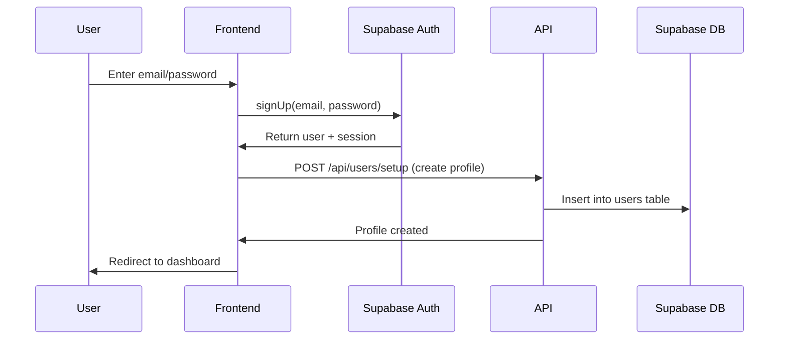
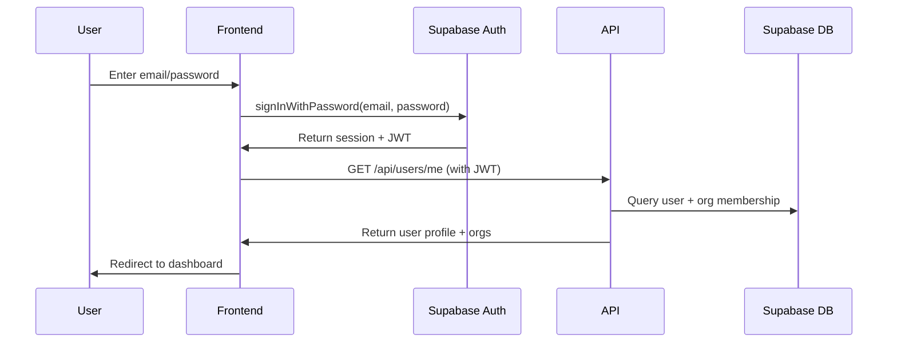
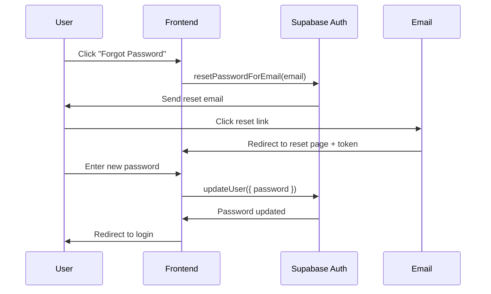
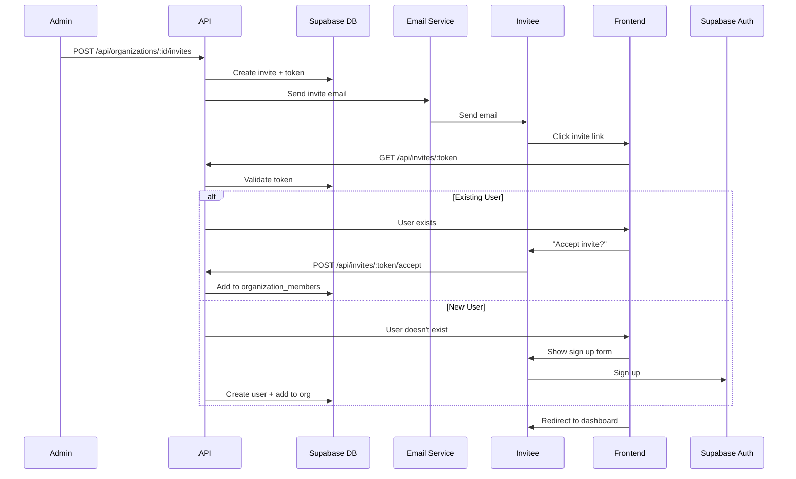

# VISION Platform V2 - Supabase Backend Integration Plan

## Executive Summary

This document provides a comprehensive implementation plan for migrating the VISION Platform V2 from mock data/localStorage to a production-ready backend using Supabase (PostgreSQL + Auth + Storage + Realtime) and Vercel (Edge Functions + Deployment).

**Total Estimated Effort:** 312 hours (7-8 weeks with 2 developers)

**Technology Stack:**
- **Database:** Supabase PostgreSQL with Row Level Security (RLS)
- **Authentication:** Supabase Auth with JWT tokens
- **File Storage:** Supabase Storage with CDN
- **Real-time:** Supabase Realtime subscriptions
- **API Layer:** Vercel Edge Functions + Supabase Client SDK
- **Deployment:** Vercel with automatic previews

---

## Table of Contents

1. [Architecture Overview](#architecture-overview)
2. [Complete Database Schema](#complete-database-schema)
3. [Row Level Security Policies](#row-level-security-policies)
4. [Service Layer Conversion](#service-layer-conversion)
5. [API Endpoint Specifications](#api-endpoint-specifications)
6. [Authentication Flows](#authentication-flows)
7. [Migration File Structure](#migration-file-structure)
8. [Implementation Priority](#implementation-priority)
9. [Testing Strategy](#testing-strategy)
10. [Deployment Strategy](#deployment-strategy)

---

## 1. Architecture Overview

### Current Architecture (Mock Data)
```
Frontend (Next.js 15 + React 19)
    ↓
Service Layer (localStorage)
    ↓
Mock Data (static JSON)
```

### Target Architecture (Supabase + Vercel)
```
Frontend (Next.js 15 + React 19)
    ↓
Service Layer (Supabase Client SDK)
    ↓
Vercel Edge Functions (API middleware)
    ↓
Supabase PostgreSQL (with RLS)
Supabase Auth (JWT tokens)
Supabase Storage (file uploads)
Supabase Realtime (subscriptions)
```

### Multi-Tenant Strategy

**Approach:** Single database with Row Level Security (RLS)

**Benefits:**
- Simplified deployment and maintenance
- Cost-effective for startups
- Excellent performance with proper indexing
- Native RLS provides database-level isolation
- Easy cross-organization queries for super admins

**Security:**
- RLS policies enforce organization isolation at database level
- JWT tokens contain user ID and organization ID
- All queries automatically filtered by organization
- No application-layer security checks needed

---

## 2. Complete Database Schema

### 2.1 Core Authentication & Users

```sql
-- Extends Supabase auth.users table
CREATE TABLE public.users (
  id UUID PRIMARY KEY REFERENCES auth.users(id) ON DELETE CASCADE,
  email TEXT NOT NULL UNIQUE,
  name TEXT NOT NULL,
  avatar_url TEXT,
  created_at TIMESTAMPTZ NOT NULL DEFAULT NOW(),
  updated_at TIMESTAMPTZ NOT NULL DEFAULT NOW()
);

CREATE TABLE public.user_preferences (
  id UUID PRIMARY KEY DEFAULT gen_random_uuid(),
  user_id UUID NOT NULL REFERENCES public.users(id) ON DELETE CASCADE,
  theme TEXT DEFAULT 'system' CHECK (theme IN ('light', 'dark', 'system')),
  notifications_enabled BOOLEAN DEFAULT true,
  email_digest TEXT DEFAULT 'daily' CHECK (email_digest IN ('realtime', 'daily', 'weekly', 'never')),
  language TEXT DEFAULT 'en',
  timezone TEXT DEFAULT 'UTC',
  created_at TIMESTAMPTZ NOT NULL DEFAULT NOW(),
  updated_at TIMESTAMPTZ NOT NULL DEFAULT NOW(),
  UNIQUE(user_id)
);

CREATE INDEX idx_user_preferences_user_id ON public.user_preferences(user_id);
```

### 2.2 Organizations & Membership

```sql
CREATE TABLE public.organizations (
  id UUID PRIMARY KEY DEFAULT gen_random_uuid(),
  name TEXT NOT NULL,
  type TEXT,
  website TEXT,
  industry TEXT,
  ein TEXT,
  logo TEXT,
  mission TEXT,
  founded_year INTEGER,
  staff_count INTEGER,
  annual_budget TEXT,
  focus_areas TEXT[],

  -- Address fields
  street TEXT,
  city TEXT,
  state TEXT,
  postal_code TEXT,
  country TEXT,

  -- Brand colors
  primary_color TEXT DEFAULT '#2563eb',
  secondary_color TEXT DEFAULT '#9333ea',

  created_at TIMESTAMPTZ NOT NULL DEFAULT NOW(),
  updated_at TIMESTAMPTZ NOT NULL DEFAULT NOW()
);

CREATE TABLE public.organization_members (
  id UUID PRIMARY KEY DEFAULT gen_random_uuid(),
  organization_id UUID NOT NULL REFERENCES public.organizations(id) ON DELETE CASCADE,
  user_id UUID NOT NULL REFERENCES public.users(id) ON DELETE CASCADE,
  role TEXT NOT NULL CHECK (role IN ('super_admin', 'org_admin', 'funder_admin', 'member', 'viewer')),
  status TEXT NOT NULL DEFAULT 'active' CHECK (status IN ('active', 'invited', 'suspended')),
  invited_by UUID REFERENCES public.users(id),
  invited_at TIMESTAMPTZ,
  joined_at TIMESTAMPTZ,
  last_active_at TIMESTAMPTZ,
  created_at TIMESTAMPTZ NOT NULL DEFAULT NOW(),
  updated_at TIMESTAMPTZ NOT NULL DEFAULT NOW(),
  UNIQUE(organization_id, user_id)
);

CREATE TABLE public.organization_invites (
  id UUID PRIMARY KEY DEFAULT gen_random_uuid(),
  organization_id UUID NOT NULL REFERENCES public.organizations(id) ON DELETE CASCADE,
  email TEXT NOT NULL,
  role TEXT NOT NULL CHECK (role IN ('super_admin', 'org_admin', 'funder_admin', 'member', 'viewer')),
  invited_by UUID NOT NULL REFERENCES public.users(id),
  token TEXT NOT NULL UNIQUE,
  expires_at TIMESTAMPTZ NOT NULL,
  accepted_at TIMESTAMPTZ,
  status TEXT NOT NULL DEFAULT 'pending' CHECK (status IN ('pending', 'accepted', 'expired', 'revoked')),
  created_at TIMESTAMPTZ NOT NULL DEFAULT NOW(),
  updated_at TIMESTAMPTZ NOT NULL DEFAULT NOW()
);

CREATE INDEX idx_org_members_org_id ON public.organization_members(organization_id);
CREATE INDEX idx_org_members_user_id ON public.organization_members(user_id);
CREATE INDEX idx_org_invites_org_id ON public.organization_invites(organization_id);
CREATE INDEX idx_org_invites_email ON public.organization_invites(email);
CREATE INDEX idx_org_invites_token ON public.organization_invites(token);
```

### 2.3 Applications Catalog

```sql
CREATE TABLE public.apps (
  id UUID PRIMARY KEY DEFAULT gen_random_uuid(),
  slug TEXT NOT NULL UNIQUE,
  name TEXT NOT NULL,
  tagline TEXT,
  description TEXT,
  icon TEXT,
  category TEXT,
  phase TEXT CHECK (phase IN ('voice', 'inspire', 'strategize', 'initiate', 'operate', 'narrate', 'funder')),
  publisher TEXT,
  website TEXT,
  documentation_url TEXT,
  support_email TEXT,
  pricing_model TEXT,
  base_price DECIMAL(10, 2),
  is_featured BOOLEAN DEFAULT false,
  is_published BOOLEAN DEFAULT true,
  install_count INTEGER DEFAULT 0,
  rating DECIMAL(3, 2),
  rating_count INTEGER DEFAULT 0,
  screenshots TEXT[],
  video_url TEXT,
  tags TEXT[],
  requirements JSONB,
  permissions JSONB,
  created_at TIMESTAMPTZ NOT NULL DEFAULT NOW(),
  updated_at TIMESTAMPTZ NOT NULL DEFAULT NOW()
);

CREATE TABLE public.app_installations (
  id UUID PRIMARY KEY DEFAULT gen_random_uuid(),
  app_id UUID NOT NULL REFERENCES public.apps(id) ON DELETE CASCADE,
  organization_id UUID NOT NULL REFERENCES public.organizations(id) ON DELETE CASCADE,
  installed_by UUID NOT NULL REFERENCES public.users(id),
  status TEXT NOT NULL DEFAULT 'active' CHECK (status IN ('active', 'suspended', 'uninstalled')),
  settings JSONB DEFAULT '{}',
  installed_at TIMESTAMPTZ NOT NULL DEFAULT NOW(),
  last_used_at TIMESTAMPTZ,
  uninstalled_at TIMESTAMPTZ,
  created_at TIMESTAMPTZ NOT NULL DEFAULT NOW(),
  updated_at TIMESTAMPTZ NOT NULL DEFAULT NOW(),
  UNIQUE(app_id, organization_id)
);

CREATE TABLE public.app_favorites (
  id UUID PRIMARY KEY DEFAULT gen_random_uuid(),
  app_id UUID NOT NULL REFERENCES public.apps(id) ON DELETE CASCADE,
  user_id UUID NOT NULL REFERENCES public.users(id) ON DELETE CASCADE,
  created_at TIMESTAMPTZ NOT NULL DEFAULT NOW(),
  UNIQUE(app_id, user_id)
);

CREATE TABLE public.app_onboarding_progress (
  id UUID PRIMARY KEY DEFAULT gen_random_uuid(),
  app_id UUID NOT NULL REFERENCES public.apps(id) ON DELETE CASCADE,
  user_id UUID NOT NULL REFERENCES public.users(id) ON DELETE CASCADE,
  organization_id UUID NOT NULL REFERENCES public.organizations(id) ON DELETE CASCADE,
  step_id TEXT NOT NULL,
  completed BOOLEAN DEFAULT false,
  completed_at TIMESTAMPTZ,
  data JSONB DEFAULT '{}',
  created_at TIMESTAMPTZ NOT NULL DEFAULT NOW(),
  updated_at TIMESTAMPTZ NOT NULL DEFAULT NOW(),
  UNIQUE(app_id, user_id, organization_id, step_id)
);

CREATE INDEX idx_apps_slug ON public.apps(slug);
CREATE INDEX idx_apps_category ON public.apps(category);
CREATE INDEX idx_apps_phase ON public.apps(phase);
CREATE INDEX idx_app_installations_org ON public.app_installations(organization_id);
CREATE INDEX idx_app_installations_app ON public.app_installations(app_id);
CREATE INDEX idx_app_favorites_user ON public.app_favorites(user_id);
CREATE INDEX idx_app_onboarding_user_org ON public.app_onboarding_progress(user_id, organization_id);
```

### 2.4 Notifications

```sql
CREATE TABLE public.notifications (
  id UUID PRIMARY KEY DEFAULT gen_random_uuid(),
  user_id UUID NOT NULL REFERENCES public.users(id) ON DELETE CASCADE,
  organization_id UUID NOT NULL REFERENCES public.organizations(id) ON DELETE CASCADE,
  type TEXT NOT NULL CHECK (type IN ('info', 'success', 'warning', 'error', 'task', 'mention', 'system')),
  title TEXT NOT NULL,
  message TEXT NOT NULL,
  action_url TEXT,
  action_label TEXT,
  metadata JSONB DEFAULT '{}',
  read BOOLEAN DEFAULT false,
  read_at TIMESTAMPTZ,
  archived BOOLEAN DEFAULT false,
  archived_at TIMESTAMPTZ,
  created_at TIMESTAMPTZ NOT NULL DEFAULT NOW(),
  updated_at TIMESTAMPTZ NOT NULL DEFAULT NOW()
);

CREATE INDEX idx_notifications_user ON public.notifications(user_id);
CREATE INDEX idx_notifications_org ON public.notifications(organization_id);
CREATE INDEX idx_notifications_unread ON public.notifications(user_id, read) WHERE read = false;
CREATE INDEX idx_notifications_created ON public.notifications(created_at DESC);
```

### 2.5 Files & Documents

```sql
CREATE TABLE public.files (
  id UUID PRIMARY KEY DEFAULT gen_random_uuid(),
  organization_id UUID NOT NULL REFERENCES public.organizations(id) ON DELETE CASCADE,
  uploaded_by UUID NOT NULL REFERENCES public.users(id),
  name TEXT NOT NULL,
  type TEXT NOT NULL,
  size BIGINT NOT NULL,
  mime_type TEXT,
  storage_path TEXT NOT NULL UNIQUE,
  folder TEXT DEFAULT '/',
  description TEXT,
  tags TEXT[],
  is_public BOOLEAN DEFAULT false,
  download_count INTEGER DEFAULT 0,
  last_accessed_at TIMESTAMPTZ,
  metadata JSONB DEFAULT '{}',
  created_at TIMESTAMPTZ NOT NULL DEFAULT NOW(),
  updated_at TIMESTAMPTZ NOT NULL DEFAULT NOW()
);

CREATE TABLE public.documents (
  id UUID PRIMARY KEY DEFAULT gen_random_uuid(),
  organization_id UUID NOT NULL REFERENCES public.organizations(id) ON DELETE CASCADE,
  file_id UUID REFERENCES public.files(id) ON DELETE SET NULL,
  title TEXT NOT NULL,
  content TEXT,
  type TEXT NOT NULL CHECK (type IN ('grant', 'report', 'policy', 'contract', 'other')),
  status TEXT NOT NULL DEFAULT 'draft' CHECK (status IN ('draft', 'review', 'approved', 'archived')),
  version INTEGER DEFAULT 1,
  author_id UUID NOT NULL REFERENCES public.users(id),
  reviewer_id UUID REFERENCES public.users(id),
  reviewed_at TIMESTAMPTZ,
  published_at TIMESTAMPTZ,
  metadata JSONB DEFAULT '{}',
  created_at TIMESTAMPTZ NOT NULL DEFAULT NOW(),
  updated_at TIMESTAMPTZ NOT NULL DEFAULT NOW()
);

CREATE INDEX idx_files_org ON public.files(organization_id);
CREATE INDEX idx_files_folder ON public.files(organization_id, folder);
CREATE INDEX idx_files_uploaded_by ON public.files(uploaded_by);
CREATE INDEX idx_documents_org ON public.documents(organization_id);
CREATE INDEX idx_documents_status ON public.documents(status);
CREATE INDEX idx_documents_author ON public.documents(author_id);
```

### 2.6 Dashboard Data

```sql
CREATE TABLE public.tasks (
  id UUID PRIMARY KEY DEFAULT gen_random_uuid(),
  organization_id UUID NOT NULL REFERENCES public.organizations(id) ON DELETE CASCADE,
  title TEXT NOT NULL,
  description TEXT,
  status TEXT NOT NULL DEFAULT 'pending' CHECK (status IN ('pending', 'in_progress', 'completed', 'cancelled')),
  priority TEXT DEFAULT 'medium' CHECK (priority IN ('low', 'medium', 'high', 'urgent')),
  assigned_to UUID REFERENCES public.users(id),
  assigned_by UUID REFERENCES public.users(id),
  due_date DATE,
  completed_at TIMESTAMPTZ,
  metadata JSONB DEFAULT '{}',
  created_at TIMESTAMPTZ NOT NULL DEFAULT NOW(),
  updated_at TIMESTAMPTZ NOT NULL DEFAULT NOW()
);

CREATE TABLE public.deadlines (
  id UUID PRIMARY KEY DEFAULT gen_random_uuid(),
  organization_id UUID NOT NULL REFERENCES public.organizations(id) ON DELETE CASCADE,
  title TEXT NOT NULL,
  description TEXT,
  type TEXT NOT NULL CHECK (type IN ('grant', 'report', 'compliance', 'event', 'other')),
  date DATE NOT NULL,
  status TEXT NOT NULL DEFAULT 'upcoming' CHECK (status IN ('upcoming', 'today', 'overdue', 'completed')),
  priority TEXT DEFAULT 'medium' CHECK (priority IN ('low', 'medium', 'high', 'urgent')),
  owner_id UUID REFERENCES public.users(id),
  reminder_sent BOOLEAN DEFAULT false,
  completed_at TIMESTAMPTZ,
  metadata JSONB DEFAULT '{}',
  created_at TIMESTAMPTZ NOT NULL DEFAULT NOW(),
  updated_at TIMESTAMPTZ NOT NULL DEFAULT NOW()
);

CREATE TABLE public.approvals (
  id UUID PRIMARY KEY DEFAULT gen_random_uuid(),
  organization_id UUID NOT NULL REFERENCES public.organizations(id) ON DELETE CASCADE,
  title TEXT NOT NULL,
  type TEXT NOT NULL CHECK (type IN ('budget', 'expense', 'document', 'policy', 'other')),
  status TEXT NOT NULL DEFAULT 'pending' CHECK (status IN ('pending', 'approved', 'rejected', 'cancelled')),
  amount DECIMAL(10, 2),
  requested_by UUID NOT NULL REFERENCES public.users(id),
  approver_id UUID REFERENCES public.users(id),
  approved_at TIMESTAMPTZ,
  rejected_at TIMESTAMPTZ,
  rejection_reason TEXT,
  metadata JSONB DEFAULT '{}',
  created_at TIMESTAMPTZ NOT NULL DEFAULT NOW(),
  updated_at TIMESTAMPTZ NOT NULL DEFAULT NOW()
);

CREATE INDEX idx_tasks_org ON public.tasks(organization_id);
CREATE INDEX idx_tasks_assigned ON public.tasks(assigned_to);
CREATE INDEX idx_tasks_status ON public.tasks(status);
CREATE INDEX idx_deadlines_org ON public.deadlines(organization_id);
CREATE INDEX idx_deadlines_date ON public.deadlines(date);
CREATE INDEX idx_approvals_org ON public.approvals(organization_id);
CREATE INDEX idx_approvals_requester ON public.approvals(requested_by);
CREATE INDEX idx_approvals_status ON public.approvals(status);
```

### 2.7 Billing & Subscriptions

```sql
CREATE TABLE public.subscriptions (
  id UUID PRIMARY KEY DEFAULT gen_random_uuid(),
  organization_id UUID NOT NULL REFERENCES public.organizations(id) ON DELETE CASCADE,
  stripe_subscription_id TEXT UNIQUE,
  stripe_customer_id TEXT,
  plan TEXT NOT NULL CHECK (plan IN ('free', 'starter', 'professional', 'enterprise')),
  status TEXT NOT NULL DEFAULT 'active' CHECK (status IN ('active', 'trialing', 'past_due', 'cancelled', 'paused')),
  current_period_start TIMESTAMPTZ,
  current_period_end TIMESTAMPTZ,
  cancel_at_period_end BOOLEAN DEFAULT false,
  cancelled_at TIMESTAMPTZ,
  trial_ends_at TIMESTAMPTZ,
  metadata JSONB DEFAULT '{}',
  created_at TIMESTAMPTZ NOT NULL DEFAULT NOW(),
  updated_at TIMESTAMPTZ NOT NULL DEFAULT NOW()
);

CREATE TABLE public.payment_methods (
  id UUID PRIMARY KEY DEFAULT gen_random_uuid(),
  organization_id UUID NOT NULL REFERENCES public.organizations(id) ON DELETE CASCADE,
  stripe_payment_method_id TEXT NOT NULL UNIQUE,
  type TEXT NOT NULL CHECK (type IN ('card', 'bank_account', 'other')),
  last4 TEXT,
  brand TEXT,
  exp_month INTEGER,
  exp_year INTEGER,
  is_default BOOLEAN DEFAULT false,
  metadata JSONB DEFAULT '{}',
  created_at TIMESTAMPTZ NOT NULL DEFAULT NOW(),
  updated_at TIMESTAMPTZ NOT NULL DEFAULT NOW()
);

CREATE TABLE public.invoices (
  id UUID PRIMARY KEY DEFAULT gen_random_uuid(),
  organization_id UUID NOT NULL REFERENCES public.organizations(id) ON DELETE CASCADE,
  stripe_invoice_id TEXT UNIQUE,
  subscription_id UUID REFERENCES public.subscriptions(id),
  amount_due DECIMAL(10, 2) NOT NULL,
  amount_paid DECIMAL(10, 2) DEFAULT 0,
  status TEXT NOT NULL CHECK (status IN ('draft', 'open', 'paid', 'void', 'uncollectible')),
  due_date DATE,
  paid_at TIMESTAMPTZ,
  invoice_pdf TEXT,
  metadata JSONB DEFAULT '{}',
  created_at TIMESTAMPTZ NOT NULL DEFAULT NOW(),
  updated_at TIMESTAMPTZ NOT NULL DEFAULT NOW()
);

CREATE TABLE public.billing_contacts (
  id UUID PRIMARY KEY DEFAULT gen_random_uuid(),
  organization_id UUID NOT NULL REFERENCES public.organizations(id) ON DELETE CASCADE,
  name TEXT NOT NULL,
  email TEXT NOT NULL,
  phone TEXT,
  is_primary BOOLEAN DEFAULT false,
  created_at TIMESTAMPTZ NOT NULL DEFAULT NOW(),
  updated_at TIMESTAMPTZ NOT NULL DEFAULT NOW()
);

CREATE INDEX idx_subscriptions_org ON public.subscriptions(organization_id);
CREATE INDEX idx_subscriptions_stripe ON public.subscriptions(stripe_subscription_id);
CREATE INDEX idx_payment_methods_org ON public.payment_methods(organization_id);
CREATE INDEX idx_invoices_org ON public.invoices(organization_id);
CREATE INDEX idx_invoices_stripe ON public.invoices(stripe_invoice_id);
CREATE INDEX idx_billing_contacts_org ON public.billing_contacts(organization_id);
```

### 2.8 Funder-Specific Tables

```sql
CREATE TABLE public.cohorts (
  id UUID PRIMARY KEY DEFAULT gen_random_uuid(),
  organization_id UUID NOT NULL REFERENCES public.organizations(id) ON DELETE CASCADE,
  name TEXT NOT NULL,
  description TEXT,
  start_date DATE,
  end_date DATE,
  status TEXT NOT NULL DEFAULT 'active' CHECK (status IN ('planning', 'active', 'completed', 'archived')),
  total_funding DECIMAL(12, 2),
  grantee_count INTEGER DEFAULT 0,
  metadata JSONB DEFAULT '{}',
  created_at TIMESTAMPTZ NOT NULL DEFAULT NOW(),
  updated_at TIMESTAMPTZ NOT NULL DEFAULT NOW()
);

CREATE TABLE public.grantees (
  id UUID PRIMARY KEY DEFAULT gen_random_uuid(),
  cohort_id UUID NOT NULL REFERENCES public.cohorts(id) ON DELETE CASCADE,
  organization_id UUID NOT NULL REFERENCES public.organizations(id),
  status TEXT NOT NULL DEFAULT 'pending' CHECK (status IN ('pending', 'active', 'completed', 'inactive')),
  funding_amount DECIMAL(12, 2),
  start_date DATE,
  end_date DATE,
  progress_percentage INTEGER DEFAULT 0,
  last_report_date DATE,
  next_milestone_date DATE,
  metadata JSONB DEFAULT '{}',
  created_at TIMESTAMPTZ NOT NULL DEFAULT NOW(),
  updated_at TIMESTAMPTZ NOT NULL DEFAULT NOW(),
  UNIQUE(cohort_id, organization_id)
);

CREATE TABLE public.funder_activities (
  id UUID PRIMARY KEY DEFAULT gen_random_uuid(),
  organization_id UUID NOT NULL REFERENCES public.organizations(id) ON DELETE CASCADE,
  cohort_id UUID REFERENCES public.cohorts(id) ON DELETE CASCADE,
  grantee_id UUID REFERENCES public.grantees(id) ON DELETE CASCADE,
  type TEXT NOT NULL CHECK (type IN ('grant_issued', 'report_received', 'milestone_completed', 'meeting', 'site_visit', 'other')),
  title TEXT NOT NULL,
  description TEXT,
  date DATE NOT NULL,
  created_by UUID NOT NULL REFERENCES public.users(id),
  metadata JSONB DEFAULT '{}',
  created_at TIMESTAMPTZ NOT NULL DEFAULT NOW(),
  updated_at TIMESTAMPTZ NOT NULL DEFAULT NOW()
);

CREATE INDEX idx_cohorts_org ON public.cohorts(organization_id);
CREATE INDEX idx_cohorts_status ON public.cohorts(status);
CREATE INDEX idx_grantees_cohort ON public.grantees(cohort_id);
CREATE INDEX idx_grantees_org ON public.grantees(organization_id);
CREATE INDEX idx_funder_activities_org ON public.funder_activities(organization_id);
CREATE INDEX idx_funder_activities_cohort ON public.funder_activities(cohort_id);
```

### 2.9 Admin-Specific Tables

```sql
CREATE TABLE public.admin_activities (
  id UUID PRIMARY KEY DEFAULT gen_random_uuid(),
  user_id UUID NOT NULL REFERENCES public.users(id) ON DELETE CASCADE,
  action TEXT NOT NULL,
  resource_type TEXT NOT NULL,
  resource_id UUID,
  details JSONB DEFAULT '{}',
  ip_address INET,
  user_agent TEXT,
  created_at TIMESTAMPTZ NOT NULL DEFAULT NOW()
);

CREATE TABLE public.admin_settings (
  id UUID PRIMARY KEY DEFAULT gen_random_uuid(),
  key TEXT NOT NULL UNIQUE,
  value JSONB NOT NULL,
  description TEXT,
  created_at TIMESTAMPTZ NOT NULL DEFAULT NOW(),
  updated_at TIMESTAMPTZ NOT NULL DEFAULT NOW()
);

CREATE INDEX idx_admin_activities_user ON public.admin_activities(user_id);
CREATE INDEX idx_admin_activities_resource ON public.admin_activities(resource_type, resource_id);
CREATE INDEX idx_admin_activities_created ON public.admin_activities(created_at DESC);
```

---

## 3. Row Level Security Policies

### 3.1 Users Table

```sql
-- Users can read their own data
CREATE POLICY "Users can view own profile"
  ON public.users
  FOR SELECT
  USING (auth.uid() = id);

-- Users can update their own data
CREATE POLICY "Users can update own profile"
  ON public.users
  FOR UPDATE
  USING (auth.uid() = id);

-- Enable RLS
ALTER TABLE public.users ENABLE ROW LEVEL SECURITY;
```

### 3.2 Organizations Table

```sql
-- Members can view their organization
CREATE POLICY "Members can view organization"
  ON public.organizations
  FOR SELECT
  USING (
    id IN (
      SELECT organization_id
      FROM public.organization_members
      WHERE user_id = auth.uid() AND status = 'active'
    )
  );

-- Org admins can update organization
CREATE POLICY "Org admins can update organization"
  ON public.organizations
  FOR UPDATE
  USING (
    id IN (
      SELECT organization_id
      FROM public.organization_members
      WHERE user_id = auth.uid()
        AND status = 'active'
        AND role IN ('org_admin', 'super_admin')
    )
  );

-- Super admins can create organizations
CREATE POLICY "Super admins can create organizations"
  ON public.organizations
  FOR INSERT
  WITH CHECK (
    EXISTS (
      SELECT 1
      FROM public.organization_members
      WHERE user_id = auth.uid()
        AND role = 'super_admin'
        AND status = 'active'
    )
  );

ALTER TABLE public.organizations ENABLE ROW LEVEL SECURITY;
```

### 3.3 Organization Members Table

```sql
-- Members can view other members in their org
CREATE POLICY "Members can view org members"
  ON public.organization_members
  FOR SELECT
  USING (
    organization_id IN (
      SELECT organization_id
      FROM public.organization_members
      WHERE user_id = auth.uid() AND status = 'active'
    )
  );

-- Org admins can manage members
CREATE POLICY "Org admins can manage members"
  ON public.organization_members
  FOR ALL
  USING (
    organization_id IN (
      SELECT organization_id
      FROM public.organization_members
      WHERE user_id = auth.uid()
        AND status = 'active'
        AND role IN ('org_admin', 'super_admin')
    )
  );

ALTER TABLE public.organization_members ENABLE ROW LEVEL SECURITY;
```

### 3.4 Apps & Installations

```sql
-- Everyone can view published apps
CREATE POLICY "Anyone can view published apps"
  ON public.apps
  FOR SELECT
  USING (is_published = true);

-- Super admins can manage apps
CREATE POLICY "Super admins can manage apps"
  ON public.apps
  FOR ALL
  USING (
    EXISTS (
      SELECT 1
      FROM public.organization_members
      WHERE user_id = auth.uid()
        AND role = 'super_admin'
        AND status = 'active'
    )
  );

-- Members can view org installations
CREATE POLICY "Members can view org installations"
  ON public.app_installations
  FOR SELECT
  USING (
    organization_id IN (
      SELECT organization_id
      FROM public.organization_members
      WHERE user_id = auth.uid() AND status = 'active'
    )
  );

-- Org admins can manage installations
CREATE POLICY "Org admins can manage installations"
  ON public.app_installations
  FOR ALL
  USING (
    organization_id IN (
      SELECT organization_id
      FROM public.organization_members
      WHERE user_id = auth.uid()
        AND status = 'active'
        AND role IN ('org_admin', 'super_admin')
    )
  );

ALTER TABLE public.apps ENABLE ROW LEVEL SECURITY;
ALTER TABLE public.app_installations ENABLE ROW LEVEL SECURITY;
```

### 3.5 Notifications

```sql
-- Users can only view their own notifications
CREATE POLICY "Users can view own notifications"
  ON public.notifications
  FOR SELECT
  USING (user_id = auth.uid());

-- Users can update their own notifications (mark as read)
CREATE POLICY "Users can update own notifications"
  ON public.notifications
  FOR UPDATE
  USING (user_id = auth.uid());

-- System can create notifications for users
CREATE POLICY "System can create notifications"
  ON public.notifications
  FOR INSERT
  WITH CHECK (true);

ALTER TABLE public.notifications ENABLE ROW LEVEL SECURITY;
```

### 3.6 Files & Documents

```sql
-- Members can view org files
CREATE POLICY "Members can view org files"
  ON public.files
  FOR SELECT
  USING (
    is_public = true OR
    organization_id IN (
      SELECT organization_id
      FROM public.organization_members
      WHERE user_id = auth.uid() AND status = 'active'
    )
  );

-- Members can upload files to their org
CREATE POLICY "Members can upload org files"
  ON public.files
  FOR INSERT
  WITH CHECK (
    organization_id IN (
      SELECT organization_id
      FROM public.organization_members
      WHERE user_id = auth.uid() AND status = 'active'
    )
  );

-- Members can delete their own uploads or admins can delete any
CREATE POLICY "Members can delete own files"
  ON public.files
  FOR DELETE
  USING (
    uploaded_by = auth.uid() OR
    organization_id IN (
      SELECT organization_id
      FROM public.organization_members
      WHERE user_id = auth.uid()
        AND status = 'active'
        AND role IN ('org_admin', 'super_admin')
    )
  );

ALTER TABLE public.files ENABLE ROW LEVEL SECURITY;
ALTER TABLE public.documents ENABLE ROW LEVEL SECURITY;
```

### 3.7 Billing Tables

```sql
-- Org admins can view billing for their org
CREATE POLICY "Org admins can view billing"
  ON public.subscriptions
  FOR SELECT
  USING (
    organization_id IN (
      SELECT organization_id
      FROM public.organization_members
      WHERE user_id = auth.uid()
        AND status = 'active'
        AND role IN ('org_admin', 'super_admin')
    )
  );

-- Org admins can manage billing
CREATE POLICY "Org admins can manage billing"
  ON public.subscriptions
  FOR ALL
  USING (
    organization_id IN (
      SELECT organization_id
      FROM public.organization_members
      WHERE user_id = auth.uid()
        AND status = 'active'
        AND role IN ('org_admin', 'super_admin')
    )
  );

ALTER TABLE public.subscriptions ENABLE ROW LEVEL SECURITY;
ALTER TABLE public.payment_methods ENABLE ROW LEVEL SECURITY;
ALTER TABLE public.invoices ENABLE ROW LEVEL SECURITY;
ALTER TABLE public.billing_contacts ENABLE ROW LEVEL SECURITY;
```

### 3.8 Funder Tables

```sql
-- Funder admins can view their cohorts
CREATE POLICY "Funder admins can view cohorts"
  ON public.cohorts
  FOR SELECT
  USING (
    organization_id IN (
      SELECT organization_id
      FROM public.organization_members
      WHERE user_id = auth.uid()
        AND status = 'active'
        AND role IN ('funder_admin', 'super_admin')
    )
  );

-- Funder admins can manage cohorts
CREATE POLICY "Funder admins can manage cohorts"
  ON public.cohorts
  FOR ALL
  USING (
    organization_id IN (
      SELECT organization_id
      FROM public.organization_members
      WHERE user_id = auth.uid()
        AND status = 'active'
        AND role IN ('funder_admin', 'super_admin')
    )
  );

-- Grantees can view their own grant info
CREATE POLICY "Grantees can view own grant info"
  ON public.grantees
  FOR SELECT
  USING (
    organization_id IN (
      SELECT organization_id
      FROM public.organization_members
      WHERE user_id = auth.uid() AND status = 'active'
    )
  );

ALTER TABLE public.cohorts ENABLE ROW LEVEL SECURITY;
ALTER TABLE public.grantees ENABLE ROW LEVEL SECURITY;
ALTER TABLE public.funder_activities ENABLE ROW LEVEL SECURITY;
```

---

## 4. Service Layer Conversion

### 4.1 organizationService.ts

**Current Implementation:** localStorage with mock data
**Target Implementation:** Supabase client with RLS

```typescript
// Before (localStorage)
async getOrganization(): Promise<Organization | null> {
  const raw = window.localStorage.getItem(STORAGE_KEY);
  if (!raw) return null;
  return JSON.parse(raw) as Organization;
}

// After (Supabase)
async getOrganization(): Promise<Organization | null> {
  const { data, error } = await supabase
    .from('organizations')
    .select('*')
    .eq('id', getCurrentOrgId())
    .single();

  if (error) throw error;
  return data;
}
```

**Endpoints to implement:**
- `GET /api/organizations/:id` - Get organization details
- `PATCH /api/organizations/:id` - Update organization
- `GET /api/organizations/:id/members` - List members
- `POST /api/organizations/:id/invites` - Send invite
- `DELETE /api/organizations/:id/members/:userId` - Remove member

**Complexity:** Medium (5 endpoints, RLS setup)

### 4.2 profileService.ts

**Current Implementation:** localStorage
**Target Implementation:** Supabase Auth + users table

```typescript
// Before (localStorage)
async getProfile(): Promise<UserProfile | null> {
  const raw = window.localStorage.getItem('vision.platform.profile');
  if (!raw) return null;
  return JSON.parse(raw);
}

// After (Supabase)
async getProfile(): Promise<UserProfile | null> {
  const { data: { user } } = await supabase.auth.getUser();
  if (!user) return null;

  const { data, error } = await supabase
    .from('users')
    .select('*, user_preferences(*)')
    .eq('id', user.id)
    .single();

  if (error) throw error;
  return data;
}
```

**Endpoints to implement:**
- `GET /api/users/me` - Get current user profile
- `PATCH /api/users/me` - Update profile
- `GET /api/users/me/preferences` - Get preferences
- `PATCH /api/users/me/preferences` - Update preferences
- `POST /api/users/me/avatar` - Upload avatar

**Complexity:** Medium (5 endpoints, Auth integration)

### 4.3 teamService.ts

**Current Implementation:** localStorage with mock team
**Target Implementation:** organization_members table

```typescript
// Before (localStorage)
async getTeamMembers(): Promise<TeamMember[]> {
  const raw = window.localStorage.getItem('vision.platform.team');
  if (!raw) return mockTeamMembers;
  return JSON.parse(raw);
}

// After (Supabase)
async getTeamMembers(): Promise<TeamMember[]> {
  const { data, error } = await supabase
    .from('organization_members')
    .select('*, users(*)')
    .eq('organization_id', getCurrentOrgId())
    .eq('status', 'active')
    .order('joined_at', { ascending: false });

  if (error) throw error;
  return data;
}
```

**Endpoints to implement:**
- `GET /api/teams/:orgId/members` - List team members
- `POST /api/teams/:orgId/invites` - Send team invite
- `PATCH /api/teams/:orgId/members/:userId` - Update member role
- `DELETE /api/teams/:orgId/members/:userId` - Remove member
- `GET /api/teams/:orgId/invites` - List pending invites

**Complexity:** Medium (5 endpoints, email invites)

### 4.4 notificationService.ts

**Current Implementation:** localStorage array
**Target Implementation:** Supabase Realtime subscriptions

```typescript
// Before (localStorage)
async getNotifications(): Promise<Notification[]> {
  const raw = window.localStorage.getItem('vision.platform.notifications');
  if (!raw) return [];
  return JSON.parse(raw);
}

// After (Supabase with Realtime)
async getNotifications(): Promise<Notification[]> {
  const { data, error } = await supabase
    .from('notifications')
    .select('*')
    .eq('user_id', getCurrentUserId())
    .order('created_at', { ascending: false })
    .limit(50);

  if (error) throw error;
  return data;
}

// Subscribe to realtime notifications
function subscribeToNotifications(callback: (notification: Notification) => void) {
  return supabase
    .channel('notifications')
    .on('postgres_changes', {
      event: 'INSERT',
      schema: 'public',
      table: 'notifications',
      filter: `user_id=eq.${getCurrentUserId()}`
    }, (payload) => {
      callback(payload.new as Notification);
    })
    .subscribe();
}
```

**Endpoints to implement:**
- `GET /api/notifications` - List notifications
- `PATCH /api/notifications/:id/read` - Mark as read
- `PATCH /api/notifications/read-all` - Mark all as read
- `DELETE /api/notifications/:id` - Delete notification
- Realtime subscription setup

**Complexity:** High (Realtime setup, 4 endpoints)

### 4.5 fileService.ts

**Current Implementation:** Mock file metadata
**Target Implementation:** Supabase Storage + files table

```typescript
// Before (Mock)
async getFiles(): Promise<File[]> {
  return mockFiles;
}

// After (Supabase Storage)
async getFiles(folder: string = '/'): Promise<File[]> {
  const { data, error } = await supabase
    .from('files')
    .select('*')
    .eq('organization_id', getCurrentOrgId())
    .eq('folder', folder)
    .order('created_at', { ascending: false });

  if (error) throw error;
  return data;
}

async uploadFile(file: File, folder: string = '/'): Promise<FileMetadata> {
  const orgId = getCurrentOrgId();
  const userId = getCurrentUserId();
  const storagePath = `${orgId}/${folder}/${file.name}`;

  // Upload to Supabase Storage
  const { data: uploadData, error: uploadError } = await supabase.storage
    .from('files')
    .upload(storagePath, file);

  if (uploadError) throw uploadError;

  // Create metadata record
  const { data: fileData, error: fileError } = await supabase
    .from('files')
    .insert({
      organization_id: orgId,
      uploaded_by: userId,
      name: file.name,
      type: file.type,
      size: file.size,
      storage_path: storagePath,
      folder,
    })
    .select()
    .single();

  if (fileError) throw fileError;
  return fileData;
}
```

**Endpoints to implement:**
- `GET /api/files` - List files
- `POST /api/files/upload` - Upload file
- `GET /api/files/:id/download` - Download file
- `DELETE /api/files/:id` - Delete file
- `PATCH /api/files/:id` - Update metadata

**Complexity:** High (Storage integration, 5 endpoints)

### 4.6 favoritesService.ts

**Current Implementation:** localStorage array of app IDs
**Target Implementation:** app_favorites table

```typescript
// Before (localStorage)
async getFavorites(): Promise<string[]> {
  const raw = window.localStorage.getItem('vision.platform.favorites');
  if (!raw) return [];
  return JSON.parse(raw);
}

// After (Supabase)
async getFavorites(): Promise<App[]> {
  const { data, error } = await supabase
    .from('app_favorites')
    .select('apps(*)')
    .eq('user_id', getCurrentUserId());

  if (error) throw error;
  return data.map(f => f.apps);
}

async toggleFavorite(appId: string): Promise<void> {
  const userId = getCurrentUserId();

  // Check if already favorited
  const { data: existing } = await supabase
    .from('app_favorites')
    .select('id')
    .eq('app_id', appId)
    .eq('user_id', userId)
    .single();

  if (existing) {
    // Remove favorite
    await supabase
      .from('app_favorites')
      .delete()
      .eq('id', existing.id);
  } else {
    // Add favorite
    await supabase
      .from('app_favorites')
      .insert({ app_id: appId, user_id: userId });
  }
}
```

**Endpoints to implement:**
- `GET /api/apps/favorites` - List favorite apps
- `POST /api/apps/:id/favorite` - Add to favorites
- `DELETE /api/apps/:id/favorite` - Remove from favorites

**Complexity:** Low (3 endpoints, simple CRUD)

### 4.7 onboardingService.ts

**Current Implementation:** localStorage progress tracking
**Target Implementation:** app_onboarding_progress table

```typescript
// Before (localStorage)
async getProgress(appId: string): Promise<OnboardingProgress> {
  const key = `vision.platform.onboarding.${appId}`;
  const raw = window.localStorage.getItem(key);
  if (!raw) return { appId, steps: [] };
  return JSON.parse(raw);
}

// After (Supabase)
async getProgress(appId: string): Promise<OnboardingProgress> {
  const { data, error } = await supabase
    .from('app_onboarding_progress')
    .select('*')
    .eq('app_id', appId)
    .eq('user_id', getCurrentUserId())
    .eq('organization_id', getCurrentOrgId());

  if (error) throw error;
  return {
    appId,
    steps: data.map(d => ({
      stepId: d.step_id,
      completed: d.completed,
      completedAt: d.completed_at,
      data: d.data,
    })),
  };
}

async completeStep(appId: string, stepId: string, data?: any): Promise<void> {
  const { error } = await supabase
    .from('app_onboarding_progress')
    .upsert({
      app_id: appId,
      user_id: getCurrentUserId(),
      organization_id: getCurrentOrgId(),
      step_id: stepId,
      completed: true,
      completed_at: new Date().toISOString(),
      data,
    });

  if (error) throw error;
}
```

**Endpoints to implement:**
- `GET /api/apps/:id/onboarding/progress` - Get onboarding progress
- `POST /api/apps/:id/onboarding/steps/:stepId/complete` - Complete step
- `DELETE /api/apps/:id/onboarding/reset` - Reset onboarding

**Complexity:** Low (3 endpoints, simple CRUD)

### 4.8 billingService.ts

**Current Implementation:** Mock billing data
**Target Implementation:** Stripe integration + billing tables

```typescript
// Before (Mock)
async getSubscription(): Promise<Subscription> {
  return mockSubscription;
}

// After (Supabase + Stripe)
async getSubscription(): Promise<Subscription> {
  const { data, error } = await supabase
    .from('subscriptions')
    .select('*')
    .eq('organization_id', getCurrentOrgId())
    .single();

  if (error) throw error;
  return data;
}

async updateSubscription(plan: string): Promise<Subscription> {
  // Call Stripe API to update subscription
  const response = await fetch('/api/billing/subscription', {
    method: 'PATCH',
    headers: { 'Content-Type': 'application/json' },
    body: JSON.stringify({ plan }),
  });

  if (!response.ok) throw new Error('Failed to update subscription');
  return response.json();
}
```

**Endpoints to implement:**
- `GET /api/billing/subscription` - Get subscription
- `PATCH /api/billing/subscription` - Update subscription
- `POST /api/billing/payment-methods` - Add payment method
- `DELETE /api/billing/payment-methods/:id` - Remove payment method
- `GET /api/billing/invoices` - List invoices
- `POST /api/billing/checkout` - Create checkout session
- Stripe webhook handler (`/api/webhooks/stripe`)

**Complexity:** Very High (Stripe integration, webhooks, 7 endpoints)

### 4.9 cohortService.ts (Funder)

**Current Implementation:** Mock cohort data
**Target Implementation:** cohorts + grantees tables

```typescript
// Before (Mock)
async getCohorts(): Promise<Cohort[]> {
  return mockCohorts;
}

// After (Supabase)
async getCohorts(): Promise<Cohort[]> {
  const { data, error } = await supabase
    .from('cohorts')
    .select('*, grantees(*)')
    .eq('organization_id', getCurrentOrgId())
    .order('created_at', { ascending: false });

  if (error) throw error;
  return data;
}

async createCohort(cohort: Partial<Cohort>): Promise<Cohort> {
  const { data, error } = await supabase
    .from('cohorts')
    .insert({
      ...cohort,
      organization_id: getCurrentOrgId(),
    })
    .select()
    .single();

  if (error) throw error;
  return data;
}
```

**Endpoints to implement:**
- `GET /api/funder/cohorts` - List cohorts
- `POST /api/funder/cohorts` - Create cohort
- `PATCH /api/funder/cohorts/:id` - Update cohort
- `DELETE /api/funder/cohorts/:id` - Delete cohort
- `GET /api/funder/cohorts/:id/grantees` - List grantees
- `POST /api/funder/cohorts/:id/grantees` - Add grantee
- `PATCH /api/funder/grantees/:id` - Update grantee
- `DELETE /api/funder/grantees/:id` - Remove grantee

**Complexity:** High (8 endpoints, complex relationships)

### 4.10 appSettingsService.ts

**Current Implementation:** Mock app settings
**Target Implementation:** app_installations settings JSONB

```typescript
// Before (Mock)
async getAppSettings(appId: string): Promise<AppSettings> {
  return mockAppSettings;
}

// After (Supabase)
async getAppSettings(appId: string): Promise<AppSettings> {
  const { data, error } = await supabase
    .from('app_installations')
    .select('settings')
    .eq('app_id', appId)
    .eq('organization_id', getCurrentOrgId())
    .single();

  if (error) throw error;
  return data.settings;
}

async updateAppSettings(appId: string, settings: AppSettings): Promise<void> {
  const { error } = await supabase
    .from('app_installations')
    .update({ settings })
    .eq('app_id', appId)
    .eq('organization_id', getCurrentOrgId());

  if (error) throw error;
}
```

**Endpoints to implement:**
- `GET /api/apps/:id/settings` - Get app settings
- `PATCH /api/apps/:id/settings` - Update app settings

**Complexity:** Low (2 endpoints, JSONB updates)

---

## 5. API Endpoint Specifications

### 5.1 Authentication Endpoints

#### POST /api/auth/signup
**Description:** Register new user with email/password

**Request:**
```json
{
  "email": "user@example.com",
  "password": "SecurePass123!",
  "name": "John Doe"
}
```

**Response:**
```json
{
  "user": {
    "id": "uuid",
    "email": "user@example.com",
    "name": "John Doe"
  },
  "session": {
    "access_token": "jwt-token",
    "refresh_token": "jwt-refresh-token"
  }
}
```

**Implementation:**
```typescript
export async function POST(request: Request) {
  const { email, password, name } = await request.json();

  // Create user with Supabase Auth
  const { data: authData, error: authError } = await supabase.auth.signUp({
    email,
    password,
  });

  if (authError) {
    return Response.json({ error: authError.message }, { status: 400 });
  }

  // Create user profile
  const { error: profileError } = await supabase
    .from('users')
    .insert({
      id: authData.user!.id,
      email,
      name,
    });

  if (profileError) {
    return Response.json({ error: profileError.message }, { status: 400 });
  }

  return Response.json({
    user: { id: authData.user!.id, email, name },
    session: authData.session,
  });
}
```

#### POST /api/auth/signin
**Description:** Sign in with email/password

**Request:**
```json
{
  "email": "user@example.com",
  "password": "SecurePass123!"
}
```

**Response:**
```json
{
  "user": {
    "id": "uuid",
    "email": "user@example.com",
    "name": "John Doe"
  },
  "session": {
    "access_token": "jwt-token",
    "refresh_token": "jwt-refresh-token"
  }
}
```

#### POST /api/auth/signout
**Description:** Sign out current user

**Response:**
```json
{
  "success": true
}
```

#### POST /api/auth/reset-password
**Description:** Send password reset email

**Request:**
```json
{
  "email": "user@example.com"
}
```

**Response:**
```json
{
  "success": true,
  "message": "Password reset email sent"
}
```

### 5.2 Organization Endpoints

#### GET /api/organizations/:id
**Description:** Get organization details

**Response:**
```json
{
  "id": "uuid",
  "name": "Acme Foundation",
  "type": "nonprofit",
  "website": "https://acme.org",
  "industry": "Education",
  "ein": "12-3456789",
  "logo": "https://storage.supabase.co/...",
  "mission": "Transform education through innovation",
  "founded_year": 2010,
  "staff_count": 25,
  "annual_budget": "$5M-$10M",
  "focus_areas": ["K-12 Education", "STEM"],
  "address": {
    "street": "123 Main St",
    "city": "San Francisco",
    "state": "CA",
    "postal_code": "94102",
    "country": "USA"
  },
  "brand_colors": {
    "primary": "#2563eb",
    "secondary": "#9333ea"
  },
  "created_at": "2024-01-01T00:00:00Z",
  "updated_at": "2024-01-15T12:00:00Z"
}
```

#### PATCH /api/organizations/:id
**Description:** Update organization details

**Request:**
```json
{
  "name": "Updated Name",
  "website": "https://updated.org",
  "brand_colors": {
    "primary": "#ff0000",
    "secondary": "#00ff00"
  }
}
```

**Response:** Same as GET response with updated fields

#### GET /api/organizations/:id/members
**Description:** List organization members

**Query Parameters:**
- `role` (optional): Filter by role
- `status` (optional): Filter by status
- `limit` (optional): Results per page (default: 50)
- `offset` (optional): Pagination offset

**Response:**
```json
{
  "members": [
    {
      "id": "uuid",
      "user": {
        "id": "uuid",
        "name": "John Doe",
        "email": "john@example.com",
        "avatar_url": "https://..."
      },
      "role": "org_admin",
      "status": "active",
      "joined_at": "2024-01-01T00:00:00Z",
      "last_active_at": "2024-01-15T12:00:00Z"
    }
  ],
  "total": 25,
  "limit": 50,
  "offset": 0
}
```

#### POST /api/organizations/:id/invites
**Description:** Send team invite

**Request:**
```json
{
  "email": "newmember@example.com",
  "role": "member"
}
```

**Response:**
```json
{
  "invite": {
    "id": "uuid",
    "email": "newmember@example.com",
    "role": "member",
    "status": "pending",
    "expires_at": "2024-01-22T00:00:00Z",
    "created_at": "2024-01-15T12:00:00Z"
  }
}
```

#### DELETE /api/organizations/:id/members/:userId
**Description:** Remove organization member

**Response:**
```json
{
  "success": true
}
```

### 5.3 User/Profile Endpoints

#### GET /api/users/me
**Description:** Get current user profile

**Response:**
```json
{
  "id": "uuid",
  "email": "user@example.com",
  "name": "John Doe",
  "avatar_url": "https://...",
  "preferences": {
    "theme": "dark",
    "notifications_enabled": true,
    "email_digest": "daily",
    "language": "en",
    "timezone": "America/Los_Angeles"
  },
  "organizations": [
    {
      "id": "uuid",
      "name": "Acme Foundation",
      "role": "org_admin",
      "status": "active"
    }
  ],
  "created_at": "2024-01-01T00:00:00Z",
  "updated_at": "2024-01-15T12:00:00Z"
}
```

#### PATCH /api/users/me
**Description:** Update user profile

**Request:**
```json
{
  "name": "Updated Name",
  "avatar_url": "https://new-avatar.jpg"
}
```

**Response:** Same as GET /api/users/me

#### PATCH /api/users/me/preferences
**Description:** Update user preferences

**Request:**
```json
{
  "theme": "light",
  "email_digest": "weekly"
}
```

**Response:**
```json
{
  "theme": "light",
  "notifications_enabled": true,
  "email_digest": "weekly",
  "language": "en",
  "timezone": "America/Los_Angeles"
}
```

### 5.4 Apps Endpoints

#### GET /api/apps
**Description:** List available apps

**Query Parameters:**
- `category` (optional): Filter by category
- `phase` (optional): Filter by phase
- `featured` (optional): Show only featured apps
- `search` (optional): Search by name/description
- `limit` (optional): Results per page (default: 20)
- `offset` (optional): Pagination offset

**Response:**
```json
{
  "apps": [
    {
      "id": "uuid",
      "slug": "document-manager",
      "name": "Document Manager",
      "tagline": "Organize all your documents",
      "description": "Full description...",
      "icon": "https://...",
      "category": "productivity",
      "phase": "operate",
      "publisher": "VISION",
      "pricing_model": "free",
      "is_featured": true,
      "install_count": 1523,
      "rating": 4.8,
      "rating_count": 142
    }
  ],
  "total": 45,
  "limit": 20,
  "offset": 0
}
```

#### GET /api/apps/:id
**Description:** Get app details

**Response:**
```json
{
  "id": "uuid",
  "slug": "document-manager",
  "name": "Document Manager",
  "tagline": "Organize all your documents",
  "description": "Full description with markdown support...",
  "icon": "https://...",
  "category": "productivity",
  "phase": "operate",
  "publisher": "VISION",
  "website": "https://...",
  "documentation_url": "https://...",
  "support_email": "support@example.com",
  "pricing_model": "freemium",
  "base_price": 9.99,
  "is_featured": true,
  "install_count": 1523,
  "rating": 4.8,
  "rating_count": 142,
  "screenshots": ["https://...", "https://..."],
  "video_url": "https://youtube.com/...",
  "tags": ["documents", "collaboration", "productivity"],
  "requirements": {
    "min_users": 1,
    "storage_required": "100MB"
  },
  "permissions": ["files.read", "files.write"],
  "created_at": "2024-01-01T00:00:00Z",
  "updated_at": "2024-01-15T12:00:00Z"
}
```

#### POST /api/apps/:id/install
**Description:** Install app for organization

**Response:**
```json
{
  "installation": {
    "id": "uuid",
    "app_id": "uuid",
    "organization_id": "uuid",
    "status": "active",
    "installed_at": "2024-01-15T12:00:00Z"
  }
}
```

#### DELETE /api/apps/:id/uninstall
**Description:** Uninstall app from organization

**Response:**
```json
{
  "success": true
}
```

### 5.5 Notifications Endpoints

#### GET /api/notifications
**Description:** List user notifications

**Query Parameters:**
- `unread` (optional): Filter unread only
- `type` (optional): Filter by type
- `limit` (optional): Results per page (default: 50)
- `offset` (optional): Pagination offset

**Response:**
```json
{
  "notifications": [
    {
      "id": "uuid",
      "type": "task",
      "title": "New task assigned",
      "message": "You have been assigned a new task: Review Q1 report",
      "action_url": "/tasks/123",
      "action_label": "View task",
      "read": false,
      "created_at": "2024-01-15T12:00:00Z"
    }
  ],
  "unread_count": 5,
  "total": 45,
  "limit": 50,
  "offset": 0
}
```

#### PATCH /api/notifications/:id/read
**Description:** Mark notification as read

**Response:**
```json
{
  "success": true
}
```

#### PATCH /api/notifications/read-all
**Description:** Mark all notifications as read

**Response:**
```json
{
  "success": true,
  "count": 5
}
```

#### DELETE /api/notifications/:id
**Description:** Delete notification

**Response:**
```json
{
  "success": true
}
```

### 5.6 Files Endpoints

#### GET /api/files
**Description:** List organization files

**Query Parameters:**
- `folder` (optional): Filter by folder path
- `type` (optional): Filter by file type
- `search` (optional): Search by name
- `limit` (optional): Results per page (default: 50)
- `offset` (optional): Pagination offset

**Response:**
```json
{
  "files": [
    {
      "id": "uuid",
      "name": "Q1_Report.pdf",
      "type": "document",
      "size": 2048576,
      "mime_type": "application/pdf",
      "folder": "/reports",
      "uploaded_by": {
        "id": "uuid",
        "name": "John Doe"
      },
      "created_at": "2024-01-15T12:00:00Z"
    }
  ],
  "total": 127,
  "limit": 50,
  "offset": 0
}
```

#### POST /api/files/upload
**Description:** Upload file

**Request:** multipart/form-data with file and metadata

**Response:**
```json
{
  "file": {
    "id": "uuid",
    "name": "document.pdf",
    "type": "document",
    "size": 2048576,
    "storage_path": "org-uuid/documents/document.pdf",
    "download_url": "https://storage.supabase.co/...",
    "created_at": "2024-01-15T12:00:00Z"
  }
}
```

#### GET /api/files/:id/download
**Description:** Get file download URL

**Response:**
```json
{
  "url": "https://storage.supabase.co/...",
  "expires_at": "2024-01-15T13:00:00Z"
}
```

#### DELETE /api/files/:id
**Description:** Delete file

**Response:**
```json
{
  "success": true
}
```

### 5.7 Billing Endpoints

#### GET /api/billing/subscription
**Description:** Get organization subscription

**Response:**
```json
{
  "id": "uuid",
  "plan": "professional",
  "status": "active",
  "current_period_start": "2024-01-01T00:00:00Z",
  "current_period_end": "2024-02-01T00:00:00Z",
  "cancel_at_period_end": false
}
```

#### PATCH /api/billing/subscription
**Description:** Update subscription plan

**Request:**
```json
{
  "plan": "enterprise"
}
```

**Response:** Updated subscription object

#### POST /api/billing/payment-methods
**Description:** Add payment method

**Request:**
```json
{
  "stripe_payment_method_id": "pm_xxxxx"
}
```

**Response:**
```json
{
  "payment_method": {
    "id": "uuid",
    "type": "card",
    "last4": "4242",
    "brand": "visa",
    "exp_month": 12,
    "exp_year": 2025,
    "is_default": true
  }
}
```

#### GET /api/billing/invoices
**Description:** List invoices

**Response:**
```json
{
  "invoices": [
    {
      "id": "uuid",
      "stripe_invoice_id": "in_xxxxx",
      "amount_due": 99.00,
      "amount_paid": 99.00,
      "status": "paid",
      "paid_at": "2024-01-01T00:00:00Z",
      "invoice_pdf": "https://..."
    }
  ]
}
```

#### POST /api/billing/checkout
**Description:** Create Stripe checkout session

**Request:**
```json
{
  "plan": "professional",
  "success_url": "https://app.vision.com/settings/billing?success=true",
  "cancel_url": "https://app.vision.com/settings/billing"
}
```

**Response:**
```json
{
  "checkout_url": "https://checkout.stripe.com/..."
}
```

#### POST /api/webhooks/stripe
**Description:** Handle Stripe webhooks

**Implementation:**
```typescript
export async function POST(request: Request) {
  const signature = request.headers.get('stripe-signature');
  const body = await request.text();

  let event;
  try {
    event = stripe.webhooks.constructEvent(
      body,
      signature!,
      process.env.STRIPE_WEBHOOK_SECRET!
    );
  } catch (err) {
    return Response.json({ error: 'Invalid signature' }, { status: 400 });
  }

  switch (event.type) {
    case 'customer.subscription.created':
    case 'customer.subscription.updated':
      // Update subscription in database
      break;
    case 'customer.subscription.deleted':
      // Mark subscription as cancelled
      break;
    case 'invoice.paid':
      // Record successful payment
      break;
    case 'invoice.payment_failed':
      // Handle failed payment
      break;
  }

  return Response.json({ received: true });
}
```

---

## 6. Authentication Flows

### 6.1 Sign Up Flow



**Implementation Steps:**
1. User submits registration form
2. Frontend calls `supabase.auth.signUp({ email, password })`
3. Supabase sends verification email
4. Create user profile in `users` table
5. Create default preferences in `user_preferences` table
6. Send welcome notification
7. Redirect to onboarding or dashboard

### 6.2 Sign In Flow



**Implementation Steps:**
1. User submits login form
2. Frontend calls `supabase.auth.signInWithPassword({ email, password })`
3. Supabase validates credentials and returns JWT
4. Frontend stores JWT in cookies/localStorage
5. Fetch user profile and organization memberships
6. Update `last_active_at` timestamp
7. Redirect to dashboard

### 6.3 Password Reset Flow



### 6.4 Team Invite Acceptance Flow



---

## 7. Migration File Structure

Create migration files in order to handle schema updates:

```
/supabase/migrations/
├── 20240101000001_create_users_tables.sql
├── 20240101000002_create_organizations_tables.sql
├── 20240101000003_create_apps_tables.sql
├── 20240101000004_create_notifications_tables.sql
├── 20240101000005_create_files_tables.sql
├── 20240101000006_create_dashboard_tables.sql
├── 20240101000007_create_billing_tables.sql
├── 20240101000008_create_funder_tables.sql
├── 20240101000009_create_admin_tables.sql
├── 20240101000010_enable_rls_users.sql
├── 20240101000011_enable_rls_organizations.sql
├── 20240101000012_enable_rls_apps.sql
├── 20240101000013_enable_rls_notifications.sql
├── 20240101000014_enable_rls_files.sql
├── 20240101000015_enable_rls_billing.sql
├── 20240101000016_enable_rls_funder.sql
├── 20240101000017_create_indexes.sql
└── 20240101000018_seed_initial_data.sql
```

### Migration 1: Create Users Tables

```sql
-- 20240101000001_create_users_tables.sql

-- Users table (extends auth.users)
CREATE TABLE public.users (
  id UUID PRIMARY KEY REFERENCES auth.users(id) ON DELETE CASCADE,
  email TEXT NOT NULL UNIQUE,
  name TEXT NOT NULL,
  avatar_url TEXT,
  created_at TIMESTAMPTZ NOT NULL DEFAULT NOW(),
  updated_at TIMESTAMPTZ NOT NULL DEFAULT NOW()
);

-- User preferences
CREATE TABLE public.user_preferences (
  id UUID PRIMARY KEY DEFAULT gen_random_uuid(),
  user_id UUID NOT NULL REFERENCES public.users(id) ON DELETE CASCADE,
  theme TEXT DEFAULT 'system' CHECK (theme IN ('light', 'dark', 'system')),
  notifications_enabled BOOLEAN DEFAULT true,
  email_digest TEXT DEFAULT 'daily' CHECK (email_digest IN ('realtime', 'daily', 'weekly', 'never')),
  language TEXT DEFAULT 'en',
  timezone TEXT DEFAULT 'UTC',
  created_at TIMESTAMPTZ NOT NULL DEFAULT NOW(),
  updated_at TIMESTAMPTZ NOT NULL DEFAULT NOW(),
  UNIQUE(user_id)
);

-- Triggers for updated_at
CREATE OR REPLACE FUNCTION update_updated_at_column()
RETURNS TRIGGER AS $$
BEGIN
  NEW.updated_at = NOW();
  RETURN NEW;
END;
$$ LANGUAGE plpgsql;

CREATE TRIGGER update_users_updated_at
  BEFORE UPDATE ON public.users
  FOR EACH ROW
  EXECUTE FUNCTION update_updated_at_column();

CREATE TRIGGER update_user_preferences_updated_at
  BEFORE UPDATE ON public.user_preferences
  FOR EACH ROW
  EXECUTE FUNCTION update_updated_at_column();
```

### Migration 2: Create Organizations Tables

```sql
-- 20240101000002_create_organizations_tables.sql

-- Organizations
CREATE TABLE public.organizations (
  id UUID PRIMARY KEY DEFAULT gen_random_uuid(),
  name TEXT NOT NULL,
  type TEXT,
  website TEXT,
  industry TEXT,
  ein TEXT,
  logo TEXT,
  mission TEXT,
  founded_year INTEGER,
  staff_count INTEGER,
  annual_budget TEXT,
  focus_areas TEXT[],
  street TEXT,
  city TEXT,
  state TEXT,
  postal_code TEXT,
  country TEXT,
  primary_color TEXT DEFAULT '#2563eb',
  secondary_color TEXT DEFAULT '#9333ea',
  created_at TIMESTAMPTZ NOT NULL DEFAULT NOW(),
  updated_at TIMESTAMPTZ NOT NULL DEFAULT NOW()
);

-- Organization members
CREATE TABLE public.organization_members (
  id UUID PRIMARY KEY DEFAULT gen_random_uuid(),
  organization_id UUID NOT NULL REFERENCES public.organizations(id) ON DELETE CASCADE,
  user_id UUID NOT NULL REFERENCES public.users(id) ON DELETE CASCADE,
  role TEXT NOT NULL CHECK (role IN ('super_admin', 'org_admin', 'funder_admin', 'member', 'viewer')),
  status TEXT NOT NULL DEFAULT 'active' CHECK (status IN ('active', 'invited', 'suspended')),
  invited_by UUID REFERENCES public.users(id),
  invited_at TIMESTAMPTZ,
  joined_at TIMESTAMPTZ,
  last_active_at TIMESTAMPTZ,
  created_at TIMESTAMPTZ NOT NULL DEFAULT NOW(),
  updated_at TIMESTAMPTZ NOT NULL DEFAULT NOW(),
  UNIQUE(organization_id, user_id)
);

-- Organization invites
CREATE TABLE public.organization_invites (
  id UUID PRIMARY KEY DEFAULT gen_random_uuid(),
  organization_id UUID NOT NULL REFERENCES public.organizations(id) ON DELETE CASCADE,
  email TEXT NOT NULL,
  role TEXT NOT NULL CHECK (role IN ('super_admin', 'org_admin', 'funder_admin', 'member', 'viewer')),
  invited_by UUID NOT NULL REFERENCES public.users(id),
  token TEXT NOT NULL UNIQUE,
  expires_at TIMESTAMPTZ NOT NULL,
  accepted_at TIMESTAMPTZ,
  status TEXT NOT NULL DEFAULT 'pending' CHECK (status IN ('pending', 'accepted', 'expired', 'revoked')),
  created_at TIMESTAMPTZ NOT NULL DEFAULT NOW(),
  updated_at TIMESTAMPTZ NOT NULL DEFAULT NOW()
);

-- Triggers
CREATE TRIGGER update_organizations_updated_at
  BEFORE UPDATE ON public.organizations
  FOR EACH ROW
  EXECUTE FUNCTION update_updated_at_column();

CREATE TRIGGER update_organization_members_updated_at
  BEFORE UPDATE ON public.organization_members
  FOR EACH ROW
  EXECUTE FUNCTION update_updated_at_column();

CREATE TRIGGER update_organization_invites_updated_at
  BEFORE UPDATE ON public.organization_invites
  FOR EACH ROW
  EXECUTE FUNCTION update_updated_at_column();
```

*(Remaining migrations follow similar pattern for apps, notifications, files, billing, funder, and admin tables)*

---

## 8. Implementation Priority

### Phase 1: Foundation (Week 1-2) - 40 hours

**Goal:** Set up Supabase project, authentication, and core user management

**Tasks:**
1. Create Supabase project
2. Set up development and production environments
3. Configure environment variables
4. Implement authentication (signup, signin, password reset)
5. Create users and user_preferences tables
6. Implement user profile service
7. Add JWT token management in frontend
8. Test authentication flows

**Deliverables:**
- Working authentication system
- User profile management
- Environment setup complete

**Complexity:** High (auth setup is critical)

### Phase 2: Organizations & Teams (Week 2-3) - 48 hours

**Goal:** Implement multi-tenant organization structure

**Tasks:**
1. Create organizations tables and RLS policies
2. Implement organizationService conversion
3. Implement teamService conversion
4. Add team invite flow with email
5. Build organization settings page backend
6. Implement role-based access control
7. Test organization isolation

**Deliverables:**
- Organization CRUD operations
- Team member management
- Invite system working
- RLS policies enforced

**Complexity:** High (RLS setup, multi-tenancy)

### Phase 3: Notifications System (Week 3-4) - 32 hours

**Goal:** Real-time notifications with Supabase Realtime

**Tasks:**
1. Create notifications table and RLS
2. Implement notificationService conversion
3. Set up Supabase Realtime subscriptions
4. Add notification polling fallback
5. Implement mark as read/unread
6. Add notification preferences
7. Test real-time updates

**Deliverables:**
- Real-time notification system
- Notification management UI working
- Preferences saved to database

**Complexity:** Medium-High (Realtime setup)

### Phase 4: Applications & Files (Week 4-6) - 56 hours

**Goal:** Apps catalog and file storage integration

**Tasks:**
1. Create apps and installations tables
2. Implement favoritesService and onboardingService
3. Seed apps catalog with existing mock data
4. Set up Supabase Storage buckets
5. Create files table and RLS policies
6. Implement fileService with upload/download
7. Add file preview functionality
8. Test file permissions and isolation

**Deliverables:**
- Apps catalog fully functional
- File upload/download working
- Storage integrated with RLS

**Complexity:** High (Storage integration)

### Phase 5: Dashboard Data (Week 6-7) - 40 hours

**Goal:** Tasks, deadlines, and approvals backend

**Tasks:**
1. Create dashboard tables (tasks, deadlines, approvals)
2. Implement dashboard data services
3. Add CRUD operations for each entity
4. Implement filtering and sorting
5. Add due date reminders
6. Test dashboard data flow

**Deliverables:**
- Dashboard fully backed by database
- All KPIs calculating correctly
- Real data replacing mocks

**Complexity:** Medium (straightforward CRUD)

### Phase 6: Billing Integration (Week 7-9) - 64 hours

**Goal:** Stripe integration for subscriptions and payments

**Tasks:**
1. Set up Stripe account and API keys
2. Create billing tables
3. Implement Stripe Customer Portal
4. Add subscription management endpoints
5. Implement webhook handlers
6. Add payment method management
7. Create invoice history
8. Test payment flows end-to-end

**Deliverables:**
- Stripe integration complete
- Subscription management working
- Invoices generating correctly
- Webhooks processing events

**Complexity:** Very High (third-party integration, webhooks)

### Phase 7: Funder & Admin Features (Week 9-10) - 32 hours

**Goal:** Funder cohort management and admin portal

**Tasks:**
1. Create funder tables (cohorts, grantees)
2. Implement cohortService conversion
3. Add funder activity tracking
4. Create admin activity logging
5. Implement admin settings
6. Test funder and admin flows

**Deliverables:**
- Funder portal backed by database
- Admin portal fully functional
- Activity logging working

**Complexity:** Medium (complex relationships)

---

## 9. Testing Strategy

### 9.1 Unit Tests

**Test Coverage Targets:**
- Service layer: 80%+
- API endpoints: 90%+
- RLS policies: 100%

**Tools:**
- Jest for service layer tests
- Supabase local development for RLS tests

**Example Test:**
```typescript
describe('organizationService', () => {
  it('should fetch organization for authenticated user', async () => {
    const org = await organizationService.getOrganization('org-123');
    expect(org).toBeDefined();
    expect(org.id).toBe('org-123');
  });

  it('should throw error for unauthorized access', async () => {
    await expect(
      organizationService.getOrganization('other-org-123')
    ).rejects.toThrow('Unauthorized');
  });
});
```

### 9.2 Integration Tests

**Coverage:**
- Authentication flows (signup, signin, reset)
- Organization creation and membership
- File upload and download
- Real-time notification delivery
- Stripe webhook processing

**Tools:**
- Playwright for E2E tests
- Supabase CLI for local testing

### 9.3 RLS Policy Tests

**Critical Tests:**
- Users can only access their own data
- Organization members can only see their org data
- Admins have elevated permissions
- Cross-organization data isolation

**Example:**
```sql
-- Test: User can view own profile
BEGIN;
  SET LOCAL request.jwt.claim.sub = 'user-123';

  SELECT * FROM public.users WHERE id = 'user-123';
  -- Should return 1 row

  SELECT * FROM public.users WHERE id = 'user-456';
  -- Should return 0 rows

ROLLBACK;
```

---

## 10. Deployment Strategy

### 10.1 Environment Setup

**Environments:**
1. **Local Development** - Supabase local instance
2. **Staging** - Supabase staging project
3. **Production** - Supabase production project

**Environment Variables:**
```env
# Supabase
NEXT_PUBLIC_SUPABASE_URL=https://xxx.supabase.co
NEXT_PUBLIC_SUPABASE_ANON_KEY=eyJxxx...
SUPABASE_SERVICE_ROLE_KEY=eyJxxx...

# Stripe
NEXT_PUBLIC_STRIPE_PUBLISHABLE_KEY=pk_test_xxx
STRIPE_SECRET_KEY=sk_test_xxx
STRIPE_WEBHOOK_SECRET=whsec_xxx

# Application
NEXT_PUBLIC_APP_URL=https://app.vision.com
```

### 10.2 Migration Process

**Step-by-step:**
1. Run migrations on staging environment
2. Test all functionality on staging
3. Create database backup
4. Run migrations on production
5. Deploy Next.js application to Vercel
6. Monitor error logs and metrics
7. Rollback if critical issues detected

**Rollback Plan:**
- Keep previous Vercel deployment active
- Database migrations include DOWN migrations
- Restore from backup if needed

### 10.3 Monitoring & Observability

**Metrics to Track:**
- Database query performance
- API endpoint latency
- Error rates by endpoint
- Real-time subscription connections
- File upload/download success rates
- Authentication success rates

**Tools:**
- Supabase Dashboard for DB metrics
- Vercel Analytics for frontend performance
- Sentry for error tracking
- LogRocket for session replay

---

## 11. Risk Assessment & Mitigation

### 11.1 High-Risk Areas

**1. Data Migration**
- **Risk:** Loss of existing user data during migration
- **Mitigation:** Keep localStorage as fallback, gradual migration, extensive testing

**2. RLS Policy Bugs**
- **Risk:** Users accessing other organizations' data
- **Mitigation:** Comprehensive RLS tests, manual security audit, bug bounty

**3. Stripe Integration**
- **Risk:** Payment failures, webhook issues
- **Mitigation:** Extensive testing in Stripe test mode, webhook retry logic, monitoring

**4. Performance Degradation**
- **Risk:** Database queries slower than localStorage
- **Mitigation:** Proper indexing, query optimization, caching layer, CDN for assets

**5. Real-time Connection Limits**
- **Risk:** Too many simultaneous connections
- **Mitigation:** Connection pooling, polling fallback, optimize subscriptions

### 11.2 Mitigation Strategies

1. **Gradual Rollout:** Deploy to 10% of users initially
2. **Feature Flags:** Ability to toggle between old and new backend
3. **Monitoring:** Real-time alerts for errors and performance issues
4. **Rollback Plan:** Documented steps to revert to previous version
5. **User Communication:** Clear messaging about changes and downtime

---

## 12. Success Criteria

### 12.1 Functional Requirements

✅ All 24 pages work with real backend data
✅ Authentication flows complete (signup, signin, reset, invite)
✅ Multi-tenant isolation enforced via RLS
✅ File upload/download working
✅ Real-time notifications delivered
✅ Billing integration with Stripe complete
✅ Admin and funder portals functional

### 12.2 Non-Functional Requirements

✅ Page load time < 2 seconds
✅ API response time < 500ms (p95)
✅ Database queries < 100ms (p95)
✅ File upload success rate > 99%
✅ Real-time delivery latency < 1 second
✅ Zero data leaks between organizations
✅ 99.9% uptime SLA

### 12.3 User Experience

✅ No breaking changes to UI
✅ Seamless transition from mock data
✅ Improved performance vs localStorage
✅ Offline mode gracefully handled
✅ Clear error messages for failures

---

## 13. Next Steps After Implementation

Once Supabase backend integration is complete, the following features can be built:

1. **Advanced Search** - Full-text search across apps, files, documents
2. **Analytics Dashboard** - Usage metrics, engagement tracking
3. **Webhooks** - Allow third-party integrations
4. **API Keys** - Programmatic access for enterprises
5. **Mobile Apps** - iOS and Android native apps
6. **Desktop App** - Electron wrapper for offline mode
7. **AI Features** - Document summarization, smart recommendations
8. **Advanced Reporting** - Custom report builder
9. **Workflow Automation** - Zapier-style automations
10. **White-label Solution** - Custom branding for enterprises

---

## 14. Appendix

### 14.1 Useful Links

- [Supabase Documentation](https://supabase.com/docs)
- [Supabase Row Level Security Guide](https://supabase.com/docs/guides/auth/row-level-security)
- [Vercel Edge Functions](https://vercel.com/docs/functions/edge-functions)
- [Stripe Integration Guide](https://stripe.com/docs/payments/accept-a-payment)
- [Next.js 15 Documentation](https://nextjs.org/docs)

### 14.2 Team Roles

**Backend Engineer:**
- Supabase schema design
- RLS policy implementation
- API endpoint development
- Migration file creation

**Frontend Engineer:**
- Service layer conversion
- UI integration with Supabase
- Error handling
- Loading states

**DevOps:**
- Environment setup
- CI/CD pipeline
- Monitoring setup
- Deployment automation

**QA Engineer:**
- Test plan creation
- RLS policy testing
- E2E test automation
- Security testing

---

**Document Version:** 1.0
**Last Updated:** 2025-01-23
**Status:** Ready for Implementation
